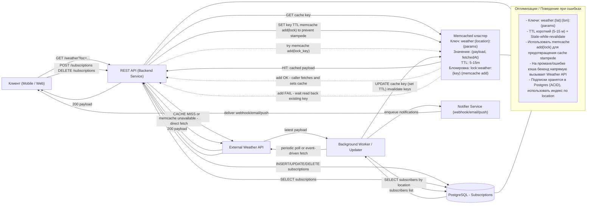

# Отчет по Практике 2: Вартанян Леонтий

## 1. Анализ промптов R.C.T.F.

### Апгрейд архитектуры
**Role:** Senior Backend Engineer с опытом в проектировании и написании REST API
**Context:** Система должна быть оптимизировать вызовы к Weather API через кэширование
**Task:** Добавь memcache для кэша погоды. покажи взаимодействие с PostgreSQL для подписок
**Format:** Mermaid диаграмма компонентов
**Результат:** Сгенерирована новая mermaid диаграмма
---
### Gherkin
**Role:** Действуй как опытный QA Automation Engineer с 8-летним опытом в написании автоматизированных тестов для веб-сервисов и ботов
**Context:** UserStory - Как пользователь, я хочу подписываться на города через простой UI, чтобы быстро получать уведомления о погодных изменениях.
**Task:** Напиши детальные Acceptance Criteria для этой User Story
**Format:** Используй строгий Gherkin-синтаксис (Given/When/Then).
**Результат:** Сгенерирована 5 Gherkin сценариев
---
### DOR
**Role:** Действий как опытный Product owner, который имеет 10 лет опыта работы с Scrum/Agile
**Context:** Мы разрабатываем WeatherApp — REST API сервис для уведомлений о текущей погоде. Наш текущий Definition of Ready v1.0: Definition of Ready (DoR) — чек-лист для задач (4–6 пунктов): - Описание задачи сформулировано и содержит приемочные критерии (Gherkin / GIVEN-WHEN-THEN). - Все внешние зависимости (API-ключи Weather provider, SMS-провайдеры, push-сертификаты) перечислены и доступны/задокументированы. - Дизайн/UX макеты и API контракты согласованы (если есть UI/API изменения) и доступны в репозитории. - Оценка задачи выполнена командой (story points) и согласован объём работ. - Нужные данные для тестирования (тестовые аккаунты, sandbox-ключи, mock-данные) подготовлены. - Критические риски и отклонения идентифицированы и описаны (например, rate limits, cost implications)..
**Task:** Создай улучшенную версию Definition Of Ready v2
**Format:** Структурированный чек-лист в Markdown с категориями: - Requirements (требования к задаче) - Technical (технические аспекты) - Design (дизайн API/контракты) - Testing (тестирование) - Documentation (документация)
**Результат:** Сгенерированы новый пункты DoR. Разбиты на категории. Формат - чеклист
---
### DOD
**Role:** Действуй, как Scrum Master c 10 годами опыта с опытом в DevOps и CI/CD
**Context:** Мы разрабатываем WeatherApp — REST API сервис для уведомлений о текущей погоде. (далее большой текст из практики 1)
**Task:** Создай улучшенную версию Definition of Done
**Format:** Структурированный чек-лист в Markdown с категориями: - Code (код) - Tests (тесты) - Documentation (документация) - Review (код-ревью) - Deployment (деплой) Каждая категория должна содержать 3-5 конкретных пунктов.
**Результат:** Сгенерированы новый пункты DoD. Разбиты на категории. Формат - чеклист
---
### Test plan
**Role:** Действуй как Test Lead с 10-летним опытом в тестировании Python-приложений, ботов и микросервисов
**Context:** Мы готовимся к тестированию User Story: Как пользователь, я хочу подписываться на города через простой UI, чтобы быстро получать уведомления о погодных изменениях. (далее перчислены компоненты системы)
**Task:** Создай комплексный план тестирования для этой фичи. Включи тесты на всех уровнях: unit, integration, end-to-end.
**Format:** Markdown-таблица со следующими колонками: | ID | Тип | Компонент | Описание | Предусловия | Шаги | Ожидаемый результат |
**Результат:** Сгенерирован план тестирования
---
### Functional delivery
**Role:** Действуй как профессиональный Senior Delivery Manager с опытом работы по Scrum Agile и управлением Backlog
**Context:** У нас есть базовые Jira-тикеты для WeatherService v1.0: (далее идут первые 4 тикета из практики 1)
**Task:** Улучши эти тикеты до профессионального уровня.
**Format:** Структурированный список тикетов в Markdown. Каждый тикет должен содержать: - Title (название) - Description (описание задачи) - Acceptance Criteria (детальные в формате Given/When/Then) - Test Cases (детальные тест-кейсы) - Dependencies (зависимости от других тикетов) - Priority (High/Medium/Low) - Estimate (story points или часы)
**Результат:** Сгенерированы тикеты по новому формату
---
## 2. Улучшенные артефакты

### Mermaid v2


```

### Gherkin Scenarios
```gherkin

Scenario 1: Успешная подписка — кэш MISS (новый город, кэш пуст)
  Given В базе данных нет подписки для email "user@example.com" и города "London"
  And Memcache не содержит ключа "weather:London"
  And external OpenWeatherMap stub возвращает HTTP 200 и тело погодных данных:
    { "temp": 12, "condition": "Cloudy", "city": "London" }
  When Клиент отправляет POST /subscribe с телом:
    { "city": "London", "email": "user@example.com" }
  Then API возвращает HTTP 201 Created
  And Тело ответа содержит JSON поля:
    - subscription_id (UUID)
    - email == "user@example.com"
    - city == "London"
    - weather == { "temp": 12, "condition": "Cloudy", "city": "London" }
  And В PostgreSQL создана новая запись в таблице subscriptions с полями:
    - email = "user@example.com"
    - city = "London"
    - notification_time = NULL (или значение по умолчанию)
  And Memcache установлен ключ "weather:London" со значением погодного payload
  And TTL этого ключа = 600 секунд (±5 секунд)
  And Запросов к OpenWeatherMap было ровно 1

Scenario 2: Успешная подписка — кэш HIT (погодные данные берутся из Memcache)
  Given В базе данных нет подписки для email "alice@example.com" и города "Paris"
  And Memcache содержит ключ "weather:Paris" со значением:
    { "temp": 20, "condition": "Sunny", "city": "Paris" } с TTL >= 300 секунд
  And OpenWeatherMap stub настроен отслеживать вызовы (но реального вызова ожидать не нужно)
  When Клиент отправляет POST /subscribe с телом:
    { "city": "Paris", "email": "alice@example.com" }
  Then API возвращает HTTP 201 Created
  And Тело ответа содержит JSON поля:
    - subscription_id (UUID)
    - email == "alice@example.com"
    - city == "Paris"
    - weather == { "temp": 20, "condition": "Sunny", "city": "Paris" }
  And В PostgreSQL создана запись subscriptions с email и city как выше
  And Memcache ключ "weather:Paris" остался (обновление допускается, но новый запрос к OWM не должен выполняться)
  And Запросов к OpenWeatherMap = 0 (нет внешнего вызова)

Scenario 3: Негативный — несуществующий город (OpenWeatherMap возвращает not found)
  Given В базе данных нет подписки для email "bob@example.com" и города "Atlantis"
  And Memcache не содержит ключа "weather:Atlantis"
  And OpenWeatherMap stub возвращает HTTP 404 или payload, означающий "city not found"
  When Клиент отправляет POST /subscribe с телом:
    { "city": "Atlantis", "email": "bob@example.com" }
  Then API возвращает HTTP 400 Bad Request (или 422 Unprocessable Entity) с JSON:
    { "error": "City not found", "city": "Atlantis" }
  And В PostgreSQL НЕ создаётся новая запись для этого email и города
  And Memcache НЕ получает ключ "weather:Atlantis"
  And Запросов к OpenWeatherMap = 1

Scenario 4: Негативный — дубликат подписки (email уже подписан на тот же город)
  Given В PostgreSQL уже существует запись subscriptions:
    - email = "dup@example.com"
    - city = "Tokyo"
  And Memcache может содержать или не содержать ключ "weather:Tokyo" (не влияет)
  When Клиент отправляет POST /subscribe с телом:
    { "city": "Tokyo", "email": "dup@example.com" }
  Then API возвращает HTTP 409 Conflict с JSON:
    { "error": "Subscription already exists", "email": "dup@example.com", "city": "Tokyo" }
  And В PostgreSQL количество записей для (email="dup@example.com", city="Tokyo") остаётся 1 (без дубликатов)
  And OpenWeatherMap НЕ вызывается (если логика позволяет — проверка: запросов к OWM = 0)
  And Статус операции не приводит к изменению TTL/значения в Memcache для "weather:Tokyo"

Scenario 5: Граничный случай — город с пробелами и спецсимволами (нормализация)
  Given В базе данных нет подписки для email "norm@example.com"
  And Внешний stub OpenWeatherMap настроен принимать нормализованное имя города "New York" и возвращать:
    { "temp": 5, "condition": "Snow", "city": "New York" }
  And Memcache не содержит ключа "weather:New York"
  When Клиент отправляет POST /subscribe с телом, где city содержит лишние пробелы и спецсимволы:
    { "city": "  New   York  ", "email": "norm@example.com" }
  Then API возвращает HTTP 201 Created
  And API нормализует имя города перед использованием:
    - в вызове к OpenWeatherMap используется "New York"
    - в записи PostgreSQL сохраняется "New York" (трим/сжатие пробелов, сохранять Unicode)
    - в Memcache ключ = "weather:New York"
  And Тело ответа содержит weather == { "temp": 5, "condition": "Snow", "city": "New York" }
  And Запросов к OpenWeatherMap = 1
  And Memcache ключ установлен с TTL = 600 секунд (±5 секунд)

```

### DoR v2.0

## Requirements (требования к задаче)
- [ ] User Story сформулирована и содержит полные Acceptance Criteria в Gherkin (Given/When/Then) — позитивные и негативные сценарии, пограничные случаи.
- [ ] Бизнес‑приоритет и критерии успеха (KPI): ожидаемое количество подписок, ожидаемый % успешных доставок уведомлений, SLA ответа API (например p95 < 300ms).
- [ ] Ограничения и non‑functional требования: допустимые rate limits (внутренние и внешние), SLA, требования к конфиденциальности/шифрованию персональных данных (email), требования к локализации/кодировке.
- [ ] Перечислены внешние зависимости (OpenWeatherMap API + ключи, memcache/Redis, PostgreSQL доступ, SMTP/SMS/push провайдеры) и их статус (доступны/в ожидании).
- [ ] Описание отклонений/рисков и рекомендованные mitigations (например: лимиты OWM, стоимость вызовов, отказ memcache — fallback план).

## Technical (технические аспекты)
- [ ] Все необходимые секреты/ключи/доступы задокументированы и доступны в секретном хранилище (env vars / Vault) для dev/staging/prod; указаны форматы и TTL ключей.
- [ ] Технические требования: схема БД (таблица subscriptions: id(UUID), email, city_normalized, notification_time, created_at, unique(email, city_normalized)), миграция SQL либо миграционный план (Alembic).
- [ ] Кэш‑стратегия: memcache ключи и формат (например weather:{city_normalized}), TTL по умолчанию = 600s, stale‑while‑revalidate поведение, механизмы предотвращения stampede (memcache.add lock) — указаны в задаче.
- [ ] Контракты ошибок и коды статусов (например 201, 400/422, 409, 500) описаны; требование к логированию ошибок/метрик (кол‑во вызовов OWM, cache hit/miss, subscriptions.created).
- [ ] Наличие требований по backward compatibility, idempotency (поддержка повторных POST /subscribe — возврат 409 или idempotent response), и лимитам запросов со стороны клиента.

## Design (дизайн API/контракты)
- [ ] OpenAPI / Swagger спецификация обновлена и приложена для эндпоинтов, затронутых задачей (пример запросов/ответов, схемы полей, валидаторы).
- [ ] Примеры payloads (request/response), включая ошибочные ответы и заголовки (Content-Type, Authorization, X-Request-ID).
- [ ] Правила нормализации входных данных (trim, collapse multiple spaces, unicode normalization, case rules) и валидации email/city — описаны и согласованы.
- [ ] Политика версионирования API (например: /v1/subscribe) и требования к совместимости изменений.
- [ ] UX/UX макеты или API‑flow для взаимодействия клиента с возвращаемыми данными (например, какие поля отображать в UI после подписки) — приложены, если есть UI изменения.

## Testing (тестирование)
- [ ] Тестовые данные и окружения: подготовлены тестовые аккаунты, sandbox API‑ключи для OpenWeatherMap, тестовая база PostgreSQL и тестовый memcache/Redis; доступы задокументированы.
- [ ] Моки/стабы: готовы и доступны для внешних вызовов (OWM) с возможностью настраивать ответы (200, 404, 5xx) и отслеживать количество вызовов.
- [ ] Набор тестов описан: unit, integration, contract (OpenAPI), end‑to‑end сценарии, а также негативные и пограничные кейсы; указаны критерии прохождения (CI green).
- [ ] Нагрузочные/перф тесты: минимальный сценарий нагрузки (например 100 rps в пиковое время) и план тестирования кэша (удар по одному ключу на cache miss для проверки stampede mitigation).
- [ ] Security/QA проверки: валидация входных данных (инъекции), проверка прав доступа/auth, проверка утечек PII в логах, и тесты на отказоустойчивость (memcache down, OWM 429/5xx).

## Documentation (документация)
- [ ] README и Runbook: шаги по локальному запуску/развёртыванию фичи, переменные окружения, миграции; checklist post‑deploy (smoke tests).
- [ ] API docs (OpenAPI) опубликованы и содержат примеры запросов/ответов, описание ошибок, и примеры curl.
- [ ] Operational docs: инструкции по мониторингу и алертингу (метрики: cache_hit_rate, owm_calls, subscriptions.created, failed_subscriptions), и playbook на случай превышения rate limit у OWM или падения memcache.
- [ ] Change log / Release notes: краткое описание изменений, потенциальные breaking changes и миграционные шаги (если есть).
- [ ] Доступные тестовые сценарии и список mock endpoints (URL + описание поведений) для QA и интеграционных тестов.


### DoD v2.0

## Code
- [ ] Реализация соответствует Acceptance Criteria (Gherkin) и бизнес‑логике; код понятен и поддерживаем (type hints, docstrings, разумная декомпозиция).
- [ ] Валидация входа (Pydantic DTO) реализована и возвращает строго заданные HTTP‑коды/формат ошибок (400/422) согласно контракту.
- [ ] Idempotency и целостность: уникальный индекс (email, city_normalized) в PostgreSQL + обработка дубликатов (409 Conflict) в коде; транзакции атомарны.
- [ ] DB миграции (Alembic) включены в PR с понятным планом отката (downgrade) и проверкой на тестовой БД.
- [ ] Нет хардкодированных секретов/ключей; конфигурация через env/Vault; sensitive values не попадают в логи/репозиторий.

## Tests
- [ ] Unit tests: покрытие для новых/изменённых модулей не ниже установленного порога (например, ≥80% для модулей фичи); все unit тесты проходят в CI.
- [ ] Integration tests: CRUD к PostgreSQL, взаимодействие с memcache (cache hit/miss), и поведение при недоступном cache — настроены и проходят в CI (использовать тестовую БД и локальный/stub memcache).
- [ ] Contract/API tests: OpenAPI схемы проверены против ответов (status codes, JSON schema), включая error‑cases (400/409/500).
- [ ] End‑to‑end / smoke tests: сценарий subscribe → DB запись → cache set → (имитация) уведомление через тестовый SMTP выполняется в staging; тесты автоматизированы в pipeline.
- [ ] Performance sanity: простые нагрузочные проверки для критичных путей (Scheduler aggregation, N подписок), убеждаемся, что агрегация по городу уменьшает внешний трафик и соблюдаются SLA.

## Documentation
- [ ] OpenAPI/Swagger обновлён и опубликован; примеры request/response для успешного и ошибочного сценариев включены.
- [ ] Runbook & Rollback: шаги post‑deploy smoke, проверяемые проверки (DB, cache, health endpoints), и чёткий rollback plan (как откатить миграции/деплой).
- [ ] Миграционная и схема БД документация: таблицы, индексы, уникальные ограничения, поля (notification_time и т.д.).
- [ ] Операционная документация: метрики/alert names (например cache_hit_rate, owm_calls, subscriptions.created, failed_notifications), threshold и контакты on‑call.
- [ ] Release notes и список breaking changes; если требуется — фича включена за флагом/feature toggle.

## Review

## 3. MVP Weather History

### Конфигурация
- Укажите `OPENWEATHER_API_KEY` в `.env`.
- Укажите `DATABASE_URL` для PostgreSQL, потому что history endpoint сохраняет дневные записи в таблицу `weather_history`.
- Перед запуском примените миграции: `cd practices/practice_03 && alembic upgrade head`.

### Запуск и проверка
- Запустите API: `cd practices/practice_03 && uvicorn src.main:app --reload`.
- Вызовите happy-path endpoint:
  `curl "http://127.0.0.1:8000/weather/Moscow/history?start_date=2026-03-20&end_date=2026-03-22"`.
- Ожидаемый результат: `200 OK`, массив `records`, отсортированный по возрастанию `date`, и `source="provider"` для записей MVP-сценария.

### Локальный mock-режим без paid History API
- Установите в `.env`: `MOCK_HISTORY_ENABLED=true`
- Перезапустите `uvicorn`, чтобы приложение перечитало настройки.
- После этого `GET /weather/{city}/history` будет возвращать детерминированные локальные данные без обращения к OpenWeather History API.
- Этот режим затрагивает только history endpoint и удобен для ручной проверки через `curl` или браузер.

### Точечные проверки
- Unit и service-сценарии: `./.venv/bin/pytest practices/practice_03/tests/test_history_service.py`
- HTTP contract history endpoint: `./.venv/bin/pytest practices/practice_03/tests/test_weather_history_endpoint.py`
- [ ] Code review: минимум 1 approval от коллеги + 1 от техлида/архитектора для значимых изменений; все комментарии обработаны.
- [ ] Security review: secret handling, dependency scans (Snyk/OSS scan), static analysis (bandit/mypy), и исправлены критические находки.
- [ ] Architecture/Infra review: одобрение изменений в infra (Terraform/helm) если изменение влияет на деплой/ресурсы/сеть.
- [ ] QA sign‑off: acceptance tests (Gherkin) зелёные, негативные и граничные кейсы покрыты и результаты прикреплены к PR.

## Deployment
- [ ] CI/CD pipeline обновлён и выполняет: lint → unit tests → integration/contract tests → build → image scan → deploy‑to‑staging → smoke tests → gated deploy to prod.
- [ ] Deployment strategy документирована и реализована: canary/blue‑green или feature flag; автоматический smoke тест после deploy и ручное/automated promotion.
- [ ] Health checks: readiness/liveness endpoints проверены; сервис интегрирован в мониторинг (Prometheus) и dashboard создан для ключевых метрик.
- [ ] Migrations & data safety: миграции применяются в транзакции/поэтапно при необходимости; план отката протестирован в staging.
- [ ] Rollback и incident playbook: шаги отката, контакты on‑call, и проверка алертов настроены; smoke rollback tested (dry run).


### Test Plan v2

| ID | Тип | Компонент | Описание | Предусловия | Шаги | Ожидаемый результат |
|-----|--------|----------------------------|------------------------------------------------------------------------------------------------------------------------------------------|-----------------------------------------------------------------------------------------------------------------------------------------------|---------------------------------------------------------------------------------------------------------------------------------------------------------------------------------------------------------------------------|------------------------------------------------------------------------------------------------------------------------------------------------------------------------------------------------------------------------------------------------------------------|
| TC-001 | Unit | Validation layer (Pydantic DTO) | Валидация корректного payload для POST /subscribe (валидный email, city) | Импортирована Pydantic модель SubscribeRequest | 1. Создать экземпляр модели SubscribeRequest с {"email":"user@example.com","city":"London"} 2. Валидировать/сериализовать модель | Модель создаётся без ошибок; поля доступны, email и city совпадают с входом; сериализация возвращает JSON с полями email и city |
| TC-002 | Unit | Validation layer (Pydantic DTO) | Негатив: некорректный email вызывает валидацию и возвращает ошибку | Pydantic модель доступна | 1. Попытаться создать SubscribeRequest с {"email":"not-an-email","city":"Paris"} 2. Поймать ValidationError | Бросается ValidationError; в ошибке присутствует причина (invalid email); поведение соответствует FastAPI — 422 при использовании в endpoint |
| TC-003 | Unit | Validation / Business logic | Нормализация названия города (трим, collapse multiple spaces, Unicode preserved) | Функция normalize_city(city: str) реализована | 1. Вызвать normalize_city("  New   York  ") 2. Вызвать normalize_city("München") | Результат: "New York" (single space, trimmed) и "München" (Unicode сохранён); тесты на несколько входов подтверждают ожидаемую нормализацию |
| TC-004 | Unit | Weather API client (httpx wrapper) | Weather client корректно парсит 200 ответ OpenWeatherMap в доменную модель Weather | httpx.Client/async client замокан, возвращает 200 с JSON payload | 1. Замокать httpx.get/async_get для return 200 и payload {"main":{"temp":15},"weather":[{"description":"Clear"}],"name":"London"} 2. Вызвать client.get_weather("London") | Метод возвращает экземпляр Weather с temp=15, condition="Clear", city="London"; никакие исключения не выброшены |
| TC-005 | Unit | Weather API client (error handling) | Weather client при 404 бросает CityNotFound исключение | httpx замокан возвращать 404 | 1. Замокать httpx ответ 404 для get_weather("Atlantis") 2. Вызвать client.get_weather("Atlantis") и перехватить исключение | Бросается CityNotFound (или конкретный исключительный тип); метрика/лог события о 404 зафиксирована (если реализовано) |
| TC-006 | Unit | Subscription service (business logic) | Логика подписки обнаруживает дубликат (до write) и бросает DuplicateSubscription | Репозиторий/DAO замокан для поведения "существует запись" | 1. Настроить mock repository.exists(email, city_normalized) -> True 2. Вызвать SubscriptionService.subscribe(email, city) | SubscriptionService бросает DuplicateSubscription (или возвращает результат с code=409); до вызова insert в репозитории insert не вызывается |
| TC-007 | Integration | Database layer (Postgres via testcontainers) | CRUD: Создание подписки сохраняет запись с корректными полями и unique constraint работает | Запущен Postgres через testcontainers; миграции применены; чистая таблица subscriptions | 1. Вызвать repository.create_subscription(email, city_normalized) 2. SELECT запись по email и city 3. Попытаться вставить дубликат вручную | 1. Запись присутствует с полями id, email, city_normalized, created_at, notification_time NULL 2. Повторная вставка нарушает уникальный индекс и возвращает ошибку/исключение |
| TC-008 | Integration | MemCache + Weather client + Subscription service | Кэш HIT: если memcache содержит weather:{city}, при подписке OWM не вызывается, ответ берётся из кэша | Test memcache (memcached/Redis) запущен (testcontainers или локальный), ключ weather:Paris задан значением payload; OWM http client замокан и отслеживается | 1. Установить memcache key "weather:Paris" = payload {"temp":20,"condition":"Sunny","city":"Paris"} 2. Вызвать SubscriptionService.subscribe("alice@example.com","Paris") 3. Проверить вызовы OWM client | 1. Запись в Postgres создана 2. OWM client НЕ был вызван (кол-во вызовов = 0) 3. Ответ сервиса содержит weather из кэша |
| TC-009 | Integration | MemCache down fallback + Weather client | Поведение при недоступном memcache: сервис падает обратно к прямому вызову OWM, создаёт подписку и возвращает данные | Memcache инстанс недоступен/симулируется отказ (timeout/connection error); OWM stub возвращает 200 с payload | 1. Симулировать memcache failure (connection error) 2. Вызвать SubscriptionService.subscribe("bob@example.com","Rome") 3. Проверить Postgres и возвращаемый payload | 1. Subscription успешно создан в Postgres 2. Запрос к OWM выполнен (кол-во = 1) 3. Несмотря на недоступность кэша, endpoint возвращает 201 и корректный weather payload; система логирует ошибку кэша, но завершает операцию |
| TC-010 | Integration | Cache stampede prevention (concurrency) | При одновременных запросах для одного города на cache miss только один запрос к OWM выполняется (lock via memcache.add) | Чистый memcache (без ключа weather:Barcelona); настроен mock OWM, который фиксирует количество вызовов | 1. Параллельно (например, 10 concurrent tasks) выполнить SubscriptionService.get_or_fetch_weather("Barcelona") или вызвать POST /subscribe для 10 уникальных email 2. Дождаться завершения всех задач 3. Проверить количество вызовов к OWM и состояние memcache | 1. OWM был вызван ровно 1 раз (или минимально допустимое число при lock failure) 2. Memcache содержит ключ weather:Barcelona с payload 3. Все параллельные вызовы получили одинаковый погодный payload (и не все одновременно дублировали OWM) |
| TC-011 | E2E | REST API router (FastAPI) + DB + Memcache + Weather stub | Полный позитивный сценарий: POST /subscribe создает подписку, возвращает 201 с weather, DB и cache обновлены | Запущен staging-like окружение: FastAPI app, Postgres (testcontainers), memcache (testcontainers); ОWM endpoint замокан (контролируемый stub, возвращает 200) | 1. Отправить HTTP POST /v1/subscribe {"email":"e2e@example.com","city":"London"} через httpx 2. Проверить HTTP статус и тело ответа 3. Подключиться к Postgres и memcache и проверить состояния | 1. HTTP 201, тело содержит subscription_id, email, city="London", weather payload от OWM 2. В Postgres создана запись subscriptions с соответствующими полями 3. Memcache содержит ключ "weather:London" с payload; TTL ~600s |
| TC-012 | E2E | REST API router + Weather stub (404) | Негативный E2E: несуществующий город — POST /subscribe возвращает 400/422, DB и cache не изменены | Окружение как в TC-011; OWM stub настроен возвращать 404 для city "Atlantis" | 1. Отправить HTTP POST /v1/subscribe {"email":"user2@example.com","city":"Atlantis"} 2. Проверить ответ 3. Проверить Postgres and memcache | 1. HTTP 400 (или 422 в зависимости от контрактов) с телом ошибки {"error":"City not found","city":"Atlantis"} 2. В Postgres запись НЕ создана 3. Memcache ключ "weather:Atlantis" отсутствует 4. OWM был вызван ровно 1 раз |
| TC-013 | Unit | Subscription service + idempotency | Повторный POST /subscribe с тем же email и city корректно обрабатывается: 409 и без дублирующей записи | Mock repository: при exists->True; уникальный индекс в DB представлен | 1. Вызвать SubscriptionService.subscribe("dup@example.com","Tokyo") при mock.exists->True 2. Проверить возврат/исключение | Сервис возвращает Duplicate/409; repository.insert не вызывается; в логах/метриках фиксируется попытка создания дубликата |


### Functional Delivery v2.0

# Title: WEATHERAPP-1 — Реализовать аутентификацию: signup / login (JWT)
- Description:  
  Реализовать регистрацию пользователей и вход по email/password. При успешном входе выдавать JWT access token (кодирование и срок жизни configurable). Добавить валидацию входных данных (Pydantic), безопасное хранение паролей (bcrypt/argon2), таблицу users в БД и миграцию (Alembic). Обновить OpenAPI спецификацию и добавить end‑to‑end тесты для auth flow.
- Acceptance Criteria (Gherkin):
  - Given БД содержит пустую таблицу users  
    When POST /signup с { "email": "user@example.com", "password": "Str0ngP@ss" }  
    Then API возвращает HTTP 201 и JSON { "id": <uuid>, "email": "user@example.com" }  
    And Пароль сохранён в БД как хеш (не в явном виде)
  - Given В БД есть пользователь с email "user@example.com" и корректным паролем  
    When POST /login с { "email": "user@example.com", "password": "Str0ngP@ss" }  
    Then API возвращает HTTP 200 и JSON { "access_token": "<jwt>", "token_type": "bearer" }  
    And JWT валиден (подписан секретом из env и содержит user_id и exp)
  - Given Любой запрос с некорректным телом (invalid email format)  
    When вызывается POST /signup или /login  
    Then API возвращает HTTP 400/422 и детализированную ошибку в JSON
  - Given Пользователь существует, но пароль неверный  
    When POST /login с неверным паролем  
    Then API возвращает HTTP 401 Unauthorized и не выдаёт токен
  - Given Миграции приложены в ветке  
    When выполняется alembic upgrade в тестовой БД  
    Then таблица users существует с колонками id(UUID), email(unique), password_hash, created_at
- Test Cases:
  - TC-1.1: Регистрация валидного пользователя — ожидать 201, запись в БД, пароль хеширован.
  - TC-1.2: Регистрация с некорректным email — ожидать 422, сообщение об ошибке в теле.
  - TC-1.3: Регистрация с простым паролем (не соответствует policy) — ожидать 400 с объяснением policy.
  - TC-1.4: Повторная регистрация с тем же email — ожидать 409 Conflict.
  - TC-1.5: Успешный логин — получить JWT; проверить подпись и полезную нагрузку (user_id, exp).
  - TC-1.6: Логин с неверным паролем — ожидать 401.
  - TC-1.7: OpenAPI содержит схемы /signup и /login — проверить соответствие контракту.
  - TC-1.8: Security тест: пароль не логируется, секреты не в коде.
- Dependencies:
  - Требует миграции users (описание миграции в задаче). Не зависит от других FEATURE тикетов, но остальные функциональные задачи (subscriptions) зависят от этой задачи.
- Priority: High
- Estimate: 5 story points (примерно 3–5 рабочих дней с учетом ревью и тестов)

---

# Title: WEATHERAPP-2 — Subscriptions CRUD + DB migrations (subscriptions, cities)
- Description:  
  Реализовать CRUD для подписок: POST /subscriptions, GET /subscriptions, DELETE /subscriptions/{id}. Реализовать таблицы subscriptions и cities с миграциями (Alembic). Подписки связаны с пользователем (owner_id). Добавить unique constraint (owner_id, city_normalized) и хранить city_normalized (нормализация: trim, collapse spaces, unicode preserved). Endpoints должны требовать авторизацию (JWT). Обновить OpenAPI.
- Acceptance Criteria (Gherkin):
  - Given Авторизованный пользователь с JWT и некорректным JSON  
    When POST /subscriptions с некорректным телом  
    Then API возвращает HTTP 400/422 с описанием ошибок
  - Given Авторизованный пользователь и корректный payload { "city": "London" }  
    When POST /subscriptions  
    Then API создаёт запись в subscriptions и возвращает HTTP 201 и тело { "id": <uuid>, "city": "London", "email": "<user_email>" }  
    And В БД создаётся запись с fields (id, owner_id, city_normalized="London", created_at)
  - Given Авторизованный пользователь с несколькими подписками  
    When GET /subscriptions  
    Then API возвращает HTTP 200 и список подписок текущего пользователя (пагинация не обязат.)
  - Given Подписка принадлежит другому пользователю  
    When DELETE /subscriptions/{id} от текущего пользователя  
    Then API возвращает HTTP 403 Forbidden
  - Given Подписка принадлежит текущему пользователю  
    When DELETE /subscriptions/{id}  
    Then API удаляет запись и возвращает HTTP 204 No Content
- Test Cases:
  - TC-2.1: POST /subscriptions с валидным payload (auth header) → 201, запись в БД.
  - TC-2.2: POST /subscriptions без auth → 401.
  - TC-2.3: POST /subscriptions с некорректным JSON (missing city) → 422.
  - TC-2.4: POST /subscriptions дубль (тот же user и city после нормализации) → 409 и нет дублирующей записи.
  - TC-2.5: GET /subscriptions возвращает только подписки текущего пользователя.
  - TC-2.6: DELETE /subscriptions/{id} владельцем → 204 и запись исчезла.
  - TC-2.7: DELETE чужой подписки → 403 и запись не удалена.
  - TC-2.8: Миграция проверка: unique index (owner_id, city_normalized) — попытка вставки дубликата на уровне БД вызывает ошибку.
  - TC-2.9: City normalization: вход "  New   York  " сохраняется как "New York".
- Dependencies:
  - Depends on WEATHERAPP-1 (аутентификация/JWT).
  - Alembic миграции должны быть в PR.
- Priority: High
- Estimate: 8 story points (примерно 5–8 рабочих дней включая миграции, тесты, ревью)

---

# Title: WEATHERAPP-3 — Scheduler & Weather API integration (aggregation by city)
- Description:  
  Добавить Scheduler (configurable interval) для агрегации подписок по городу, вызова OpenWeatherMap один раз на город в цикле, сохранения результатов (logs и/или таблица weather_cache) и инициирования проверки порогов (для отправки уведомлений). Реализовать retry/backoff на 5xx/429, и кэширование результатов (memcache с TTL, stale‑while‑revalidate). Добавить механизмы предотвращения cache stampede (memcache.add lock).
- Acceptance Criteria (Gherkin):
  - Given В таблице subscriptions есть N подписок на один город (например, 10 подписок на London)  
    When Scheduler запускается один цикл  
    Then Сделан ровно 1 запрос к OpenWeatherMap для города London в рамках этого цикла  
    And Результат сохранён в таблице weather_cache (city_normalized, payload, fetched_at) и/или в memcache ключ weather:London с TTL = 600s
  - Given OpenWeatherMap возвращает 5xx или 429  
    When Scheduler получает ошибку  
    Then Scheduler логирует событие, применяет retry с backoff и не генерирует уведомления с некорректными данными; при persistent failure — сохранить ошибку в лог/таблицу и создать alert
  - Given Множество параллельных запросов к get_or_fetch_weather для одного города на cache miss  
    When происходят concurrent calls  
    Then Используется lock (memcache.add) — только 1 вызов к OWM; остальные ожидают/читают из cache после установки
  - Given Конфигурация интервала изменена в env/config  
    When деплой применён  
    Then Scheduler запускается с новым интервалом без изменения кода
- Test Cases:
  - TC-3.1: Aggregation позитив — N подписок на city → 1 OWM вызов в цикле; результат в cache/DB.
  - TC-3.2: OWM 500/429 → retry behavior (exponential backoff) и логирование; при успехе после retry — данные сохранены.
  - TC-3.3: Cache miss + concurrent requests (10 parallel) → only 1 OWM call (verify via stub counts) and cache set.
  - TC-3.4: Scheduler interval change — проверка что конфигурация применяется (smoke test).
  - TC-3.5: Перформанс: Scheduler справляется с N подписок (например нагрузочный тест: 1000 подписок по 200 городам) за отведённое время окна (замер).
  - TC-3.6: Weather results persisted в weather_cache table (поля: city_normalized, payload, fetched_at).
- Dependencies:
  - Depends on WEATHERAPP-2 (subscriptions data) and availability of OpenWeatherMap API key/config.
  - Memcache (или Redis) инстанс для кэша и lock механизма.
- Priority: High
- Estimate: 13 story points (примерно 8–12 рабочих дней, включает retry logic, cache, tests и perf checks)

---

# Title: WEATHERAPP-4 — Email notifier (test SMTP) with retry & logging
- Description:  
  Реализовать компонент отправки email уведомлений (confirmation/email alerts) через тестовый SMTP (для staging/testing). Интегрировать триггер отправки: при создании подписки — confirmation email; при срабатывании порога (Scheduler) — нотификация. Добавить retry policy (exponential backoff, cap attempts), логирование попыток и неудач, и структуру для future integration с SendGrid/Sendinblue. Тестовый SMTP должен быть конфигурируемым и доступен в тест окружениях.
- Acceptance Criteria (Gherkin):
  - Given Тестовый SMTP доступен и конфигурация в env задана  
    When Создаётся подписка POST /subscriptions  
    Then Отправляется confirmation email на указанный email (в staging — тестовый SMTP сохраняет письмо)  
    And Письмо содержит deeplink на UI/подписку и корректный subject/body
  - Given Notification event (Scheduler определил условие для уведомления)  
    When Нотификация инициирована  
    Then Email отправлен пользователям подписки; при ошибке отправки применяется retry (до N попыток) с логированием каждой попытки
  - Given SMTP недоступен (симуляция отказа)  
    When происходит попытка отправки письма  
    Then Попытки логируются и планируются повторные попытки; при исчерпании попыток — создать запись failed_notifications и alert
- Test Cases:
  - TC-4.1: E2E: signup → create subscription → trigger → письмо получено в тестовом SMTP (содержит deeplink).
  - TC-4.2: Имитация отказа SMTP (connection error) → retry attempts (N attempts) logged и запись в failed_notifications после исчерпания.
  - TC-4.3: Email форматирование — subject/body содержат placeholders (city, temp, deeplink) корректно заменены.
  - TC-4.4: Массовая рассылка: N подписок на город → нотификации отправлены всем; проверка rate/throughput (тест лимитов SMTP).
  - TC-4.5: Switch to external provider stub (SendGrid) — прокси для future интеграции; поведенческий тест на success/failure.
- Dependencies:
  - Depends on WEATHERAPP-2 (subscriptions) and WEATHERAPP-3 (scheduler triggering notifications).
  - Test SMTP server or SMTP sandbox credentials available for staging/testing.
- Priority: Medium (High for MVP confirmation email; Medium for advanced retry/observability)
- Estimate: 8 story points (примерно 5–7 рабочих дней, включает retry, persistence failed_notifications, tests)


## 3. Домашнее задание

### Event Storming v2.0

### Шаги
1. Анализ текущих результатов
2. Временные линии 
3. Получение финальной версии

### Шаг 1
#### Request
Role: Действуй как опытный фасилитатор Event Storming

Context: Первый вариант Event Storming

# Events

- Пользователь подписался на город. — Пользователь успешно добавил город в список своих подписок.
- Подписка на город была отменена. — Пользователь удалил город из подписок.
- Погода для города была получена. — Сервис получил свежие данные о погоде от внешнего провайдера.
- Уведомление о погоде было отправлено. — Система разослала нотификацию подписчикам города.
- Пороговое условие было достигнуто. — Зарегистрированное условие (температура/осадки/ветер) сработало для города.
- Ошибка получения погоды была зафиксирована. — Попытка получить данные погоды завершилась ошибкой.
- Расписание обновления подписок было выполнено. — Плановый процесс обновил все активные подписки.

# Commands

- Подписать пользователя на город. — Создать или обновить подписку пользователя на мониторинг погоды в указанном городе.
- Отписать пользователя от города. — Удалить подписку и прекратить отправку уведомлений для этого города.
- Проверить погоду для города. — Запросить актуальные данные погоды у внешнего поставщика для конкретного города.
- Отправить уведомления подписчикам города. — Сгенерировать и разослать уведомления всем активным подписчикам города.
- Обновить пороговые условия подписки. — Изменить параметры триггеров (температура, осадки, ветер и т. п.) для существующей подписки.

# Actors

- Пользователь (Subscriber). — Человек, который создаёт и управляет подписками на города.
- Сервис планировщика (Scheduler). — Компонент, который запускает периодические проверки погоды и триггеры рассылок.
- Внешний провайдер погоды (Weather API). — Сторонний API, от которого сервис получает данные о погоде в реальном времени.
- Сервис уведомлений (Notification Service). — Компонент, отвечающий за доставку push/email/SMS уведомлений пользователям.
- Администратор системы. — Оператор или админ, который может управлять глобальными настройками, просматривать логи и вручную запускать/останавливать задачи.

Task: Найди 5 конкретных проблем в этом списке

Format:  Выведи результат в формате Markdown:

Список 5 проблем  в таблице с двумя столбцами - заголовок и объяснение

#### Response
| Проблема | Объяснение |
|---|---|
| 1. Неоднозначные границы событий и их полезный контекст | Многие события описаны общо (например, "Погода для города была получена") без указания обязательных полей (city_id, provider_id, timestamp, correlation_id). Это препятствует надёжной интеграции и трассировке между компонентами. |
| 2. Нет требований к идемпотентности и корреляции команд | Команды не требуют idempotency_key или correlation_id — при повторной отправке команды можно создать дубликаты подписок или дубликатные уведомления. Нужны явные правила идемпотентности. |
| 3. Отсутствуют события для неуспехов доставки и компенсаций | Есть событие «Ошибка получения погоды», но нет событий типа NotificationFailed, NotificationRetried или NotificationDeadLetter — это мешает обработке ошибок доставки и автоматическому восстановлению. |
| 4. Неясны агрегатные границы и владение данными | Список не разделяет агрегаты (Subscription, City, Notification). Не понятно, кто владеет данными (например, кто отвечает за создание/нормализацию города), что приведёт к конкуренции при консистентности и транзакциях. |
| 5. Перекрытие ролей и отсутствие интеграционных акторов | Scheduler указан как актор, но он должен быть компонентом/сервисом; нет явного актора для внешних интеграций (webhook consumers, enterprise clients). Нечёткие роли усложняют ответственность и маршрутизацию команд/событий. |

### Шаг 2
#### Request
Role: Действуй как Lead Engineer выстраивающий логику процессов работы сервиса

Context: Результаты нахождения проблем предыдущего Event Storming 

| Проблема | Объяснение |
|---|---|
| 1. Неоднозначные границы событий и их полезный контекст | Многие события описаны общо (например, "Погода для города была получена") без указания обязательных полей (city_id, provider_id, timestamp, correlation_id). Это препятствует надёжной интеграции и трассировке между компонентами. |
| 2. Нет требований к идемпотентности и корреляции команд | Команды не требуют idempotency_key или correlation_id — при повторной отправке команды можно создать дубликаты подписок или дубликатные уведомления. Нужны явные правила идемпотентности. |
| 3. Отсутствуют события для неуспехов доставки и компенсаций | Есть событие «Ошибка получения погоды», но нет событий типа NotificationFailed, NotificationRetried или NotificationDeadLetter — это мешает обработке ошибок доставки и автоматическому восстановлению. |
| 4. Неясны агрегатные границы и владение данными | Список не разделяет агрегаты (Subscription, City, Notification). Не понятно, кто владеет данными (например, кто отвечает за создание/нормализацию города), что приведёт к конкуренции при консистентности и транзакциях. |
| 5. Перекрытие ролей и отсутствие интеграционных акторов | Scheduler указан как актор, но он должен быть компонентом/сервисом; нет явного актора для внешних интеграций (webhook consumers, enterprise clients). Нечёткие роли усложняют ответственность и маршрутизацию команд/событий. |

Task: Построй две временные линии: что происходит, когда пользователь подписывается на город, и что происходит, когда система проверяет погоду и отправляет уведомления.

Format: Выведи результат в формате Markdown:

Временная линия 1: Подписка пользователя
(Команда → Событие → Команда → Событие...)

Временная линия 2: Проверка погоды и отправка уведомлений
(Команда → Событие → Команда → Событие...)

#### Response
# Временная линия 1: Подписка пользователя
(Команда → Событие → Команда → Событие...)

1. Команда: SubscribeUserToCity (user_id, city_identifier, thresholds, channels, idempotency_key)
   → Валидируется вход, проверяется idempotency_key.
2. Событие: UserSubscriptionCreated (subscription_id, user_id, city_id, thresholds, channels, correlation_id)
   → Подписка сохранена в агрегате Subscription; audit записан в БД.
3. Команда: ResolveOrCreateCity (city_identifier) [внутренняя команда агрегата City]
   → Нормализация геоданных, поиск существующего city, создание новой записи при необходимости.
4. Событие: CityNormalized (city_id, name, lat, lon, provider_key)
   → City агрегат выпустил событие, используется для кэширования и гео-индекса.
5. Команда: EnqueueConfirmationEmail (subscription_id, user_id, template=confirmation, idempotency_key)
   → Создаётся запись в email_sends и публикуется сообщение в очереди отправки (или background task).
6. Событие: EmailSendScheduled (send_id, subscription_id, recipient, template, scheduled_at)
   → Notification pipeline получил задачу; пользователь получит confirmation email.
7. Событие: UserSubscribedToCityPublished (subscription_id, user_id, city_id, correlation_id)
   → Публикация в Event Bus для аналитики и внешних интеграторов (webhooks, enterprise consumers).

Примечания:
- Каждая команда и событие несут correlation_id и idempotency_key для трассировки и предотвращения дубликатов.
- Атомарность: создание подписки и первоначальная запись email_sends выполняются в транзакции агрегата, либо через SAGA (если сторонние операции не атомарны).

# Временная линия 2: Проверка погоды и отправка уведомлений
(Команда → Событие → Команда → Событие...)

1. Команда: CheckWeatherForCity (city_id, request_cause=scheduled, correlation_id)
   → Scheduler инициирует команду по расписанию; агрегирует запросы по city_id.
2. Событие: WeatherFetchStarted (city_id, request_id, initiated_by=scheduler, started_at)
   → Логирование старта fetch; используется для метрик и timeout handling.
3. Команда: GetWeatherFromCacheOrProvider (city_id)
   → Сначала check cache (memcache); при miss — вызывается Weather Provider (OpenWeatherMap).
4. Событие: WeatherDataFetched (city_id, provider_payload, normalized_payload, fetched_at)
   → Нормализованные данные сохраняются в кэше и публикуются в Event Bus.
   Или при ошибке:
   Событие: WeatherProviderError (city_id, provider_error, retry_hint)
   → Триггер логики retry и алертов; Scheduler помечает попытку как failed.
5. Команда: EvaluateTriggersForCity (city_id, normalized_payload)
   → Domain-логика агрегата Subscription проверяет thresholds для всех активных подписок города.
6. Событие: TriggerConditionMatched (subscription_id, city_id, metric, observed_value, threshold, matched_at)
   → Для каждой сработавшей подписки генерируется notification_job.
7. Команда: DispatchNotifications (list<notification_job>, priority, correlation_id)
   → Публикация в очереди доставки (например, Redis Streams shard по city_id). Создание записей email_sends/notification_job в БД с status=scheduled.
8. Событие: NotificationScheduled (notification_id, subscription_id, channel, payload, scheduled_at)
   → Видимость pipeline; наблюдаемость.
9. Команда: WorkerProcessNotification (notification_id)
   → Worker читает из stream, рендерит шаблон, вызывает EmailProvider.deliver, ведёт retry/backoff
10. Событие: NotificationSent (notification_id, subscription_id, provider_message_id, delivered_at)
    → При успехе: обновление статуса в БД, метрики delivery, публикация события в Event Bus.
    Или при неудаче после всех попыток:
    Событие: NotificationFailed (notification_id, subscription_id, error, attempts, failed_at)
    → Пометка в DLQ, генерация alert и создание тикета на ручную ревизию.


### Шаг 3
#### Request
Role: Действуй как редактор, собирающий всё воедино

Context: По результатам предыдущего шага есть временные линии работы сервиса

# Временная линия 1: Подписка пользователя
(Команда → Событие → Команда → Событие...)

1. Команда: SubscribeUserToCity (user_id, city_identifier, thresholds, channels, idempotency_key)
   → Валидируется вход, проверяется idempotency_key.
2. Событие: UserSubscriptionCreated (subscription_id, user_id, city_id, thresholds, channels, correlation_id)
   → Подписка сохранена в агрегате Subscription; audit записан в БД.
3. Команда: ResolveOrCreateCity (city_identifier) [внутренняя команда агрегата City]
   → Нормализация геоданных, поиск существующего city, создание новой записи при необходимости.
4. Событие: CityNormalized (city_id, name, lat, lon, provider_key)
   → City агрегат выпустил событие, используется для кэширования и гео-индекса.
5. Команда: EnqueueConfirmationEmail (subscription_id, user_id, template=confirmation, idempotency_key)
   → Создаётся запись в email_sends и публикуется сообщение в очереди отправки (или background task).
6. Событие: EmailSendScheduled (send_id, subscription_id, recipient, template, scheduled_at)
   → Notification pipeline получил задачу; пользователь получит confirmation email.
7. Событие: UserSubscribedToCityPublished (subscription_id, user_id, city_id, correlation_id)
   → Публикация в Event Bus для аналитики и внешних интеграторов (webhooks, enterprise consumers).

Примечания:
- Каждая команда и событие несут correlation_id и idempotency_key для трассировки и предотвращения дубликатов.
- Атомарность: создание подписки и первоначальная запись email_sends выполняются в транзакции агрегата, либо через SAGA (если сторонние операции не атомарны).

# Временная линия 2: Проверка погоды и отправка уведомлений
(Команда → Событие → Команда → Событие...)

1. Команда: CheckWeatherForCity (city_id, request_cause=scheduled, correlation_id)
   → Scheduler инициирует команду по расписанию; агрегирует запросы по city_id.
2. Событие: WeatherFetchStarted (city_id, request_id, initiated_by=scheduler, started_at)
   → Логирование старта fetch; используется для метрик и timeout handling.
3. Команда: GetWeatherFromCacheOrProvider (city_id)
   → Сначала check cache (memcache); при miss — вызывается Weather Provider (OpenWeatherMap).
4. Событие: WeatherDataFetched (city_id, provider_payload, normalized_payload, fetched_at)
   → Нормализованные данные сохраняются в кэше и публикуются в Event Bus.
   Или при ошибке:
   Событие: WeatherProviderError (city_id, provider_error, retry_hint)
   → Триггер логики retry и алертов; Scheduler помечает попытку как failed.
5. Команда: EvaluateTriggersForCity (city_id, normalized_payload)
   → Domain-логика агрегата Subscription проверяет thresholds для всех активных подписок города.
6. Событие: TriggerConditionMatched (subscription_id, city_id, metric, observed_value, threshold, matched_at)
   → Для каждой сработавшей подписки генерируется notification_job.
7. Команда: DispatchNotifications (list<notification_job>, priority, correlation_id)
   → Публикация в очереди доставки (например, Redis Streams shard по city_id). Создание записей email_sends/notification_job в БД с status=scheduled.
8. Событие: NotificationScheduled (notification_id, subscription_id, channel, payload, scheduled_at)
   → Видимость pipeline; наблюдаемость.
9. Команда: WorkerProcessNotification (notification_id)
   → Worker читает из stream, рендерит шаблон, вызывает EmailProvider.deliver, ведёт retry/backoff
10. Событие: NotificationSent (notification_id, subscription_id, provider_message_id, delivered_at)
    → При успехе: обновление статуса в БД, метрики delivery, публикация события в Event Bus.
    Или при неудаче после всех попыток:
    Событие: NotificationFailed (notification_id, subscription_id, error, attempts, failed_at)
    → Пометка в DLQ, генерация alert и создание тикета на ручную ревизию.

Task: Подготовь финальную версию Event Storming, включив в неё все необходимые команды, события и акторов

Format:  Выведи результат в формате Markdown:

Итоговая версия Event Storming

Actors: (6-8 пунктов)
Commands: (6-8 пунктов)
Events: (6-8 пунктов)

#### Response
# Итоговая версия Event Storming

## Actors

- Пользователь (Subscriber) — создаёт и управляет подписками, указывает пороги и каналы доставки.
- Scheduler (Job Scheduler) — запускает периодические проверки, агрегирует задачи по городам.
- Weather Provider (внешний) — поставщик погодных данных (OpenWeatherMap и т. п.).
- Notification Service (EmailSender/Notifier) — отвечает за подготовку, очередь и доставку уведомлений (email/push/webhook).
- Admin / Operator — управляет конфигурацией, запускает ручные переработки, просматривает логи и DLQ.
- Integration Consumer (webhook/enterprise) — внешние системы, подписанные на события (календарь, умный дом, B2B клиенты).
- Observability System — система метрик, логов и алертов, реагирует на критические события.
- Support Agent — оператор поддержки, выполняющий ручную ревизию и ресенд из DLQ.

## Commands

- SubscribeUserToCity (user_id, city_identifier, thresholds, channels, idempotency_key)
  - Создать/обновить подписку; валидировать и зафиксировать intent.

- UnsubscribeUserFromCity (user_id, subscription_id)
  - Деактивировать подписку и остановить дальнейшие триггеры.

- UpdateSubscriptionThresholds (subscription_id, new_thresholds)
  - Обновить правила срабатывания для подписки.

- CheckWeatherForCity (city_id, request_cause, correlation_id)
  - Инициировать сбор данных (scheduler/manual) с кэшем/агрегацией.

- EvaluateTriggersForCity (city_id, weather_payload)
  - Оценить все активные подписки города и сформировать notification jobs.

- DispatchNotifications (notification_jobs[], priority, correlation_id)
  - Поместить задания в очередь доставки (stream/queue) по шардированию.

- RetryNotification / RequeueNotification (notification_id, reason)
  - Инициировать повторную отправку по политике retry или вручную.

- InvalidateWeatherCache (city_id, reason)
  - Форсировать обновление данных для конкретного города.

## Events

- UserSubscriptionCreated (subscription_id, user_id, city_id, thresholds, channels, correlation_id)
  - Подписка успешно создана; триггерит confirmation flow и публикацию в Event Bus.

- UserSubscriptionCancelled (subscription_id, user_id, city_id, reason)
  - Подписка отменена; останавливает дальнейшие рассылки.

- CityNormalized (city_id, name, lat, lon, provider_key)
  - Город нормализован/создан; используется для кэширования и гео-индексации.

- WeatherDataFetched (city_id, provider_payload, normalized_payload, fetched_at)
  - Данные о погоде получены и записаны в кэш; старт оценки триггеров.

- TriggerConditionMatched (subscription_id, city_id, metric, observed_value, threshold, matched_at)
  - Порог сработал для конкретной подписки; создаёт notification job.

- NotificationScheduled (notification_id, subscription_id, channel, payload, scheduled_at)
  - Задание на отправку помещено в очередь доставки; видно в pipeline.

- NotificationSent (notification_id, subscription_id, provider_message_id, delivered_at)
  - Уведомление успешно доставлено; обновлены метрики и аудит.

- NotificationFailed (notification_id, subscription_id, error, attempts, failed_at)
  - Отправка не удалась после всех попыток; сообщение помещено в DLQ; генерируется алерт и тикет.

- WeatherProviderError (city_id, provider_error, retry_hint, occurred_at)
  - Ошибка получения данных от провайдера; инициирована логика retry и алерты.


### Roadmap v2.0

### Шаги
1. Проверка на реалистичность
2. Добавление целей к версиям
3. Улучшенная версия Roadmap

### Шаг 1
#### Request
Role: Действуй как Project Manager с 10-летним опытом управления продуктовыми командами

Context: Есть Roadmap для приложения WeatherApp, разбитый на три версии:

# Roadmap (версии v1.0 → v2.0 → v3.0)

v1.0 — MVP (максимальная ценность при минимальных усилиях)
- Основные фичи (в порядке приоритета):
  1. Подписка/отписка на город (UI + API) — критично: core-продукт.
  2. Периодическая проверка погоды (Scheduler) + интеграция с одним Weather API — источник правды.
  3. Базовые уведомления по email (reliable delivery, retry) — доступный канал доставки.
  4. Простые пороговые условия (температура выше/ниже, осадки) на уровне подписки.
  5. Личный кабинет: список подписок и базовое управление.
  6. Логи/метрики: доставка, ошибки, SLA-метрики.

v2.0 — удержание и расширение функциональности (увеличение вовлечённости)
- Основные фичи (в порядке приоритета):
  1. Мультиканальная доставка: push, SMS, webhooks (для интеграции с другими сервисами).
  2. Поддержка множественных городов и агрегированных подписок (например, «всё, что в радиусе 50 км»).
  3. Персонализированные расписания и батчинг уведомлений (агрегировать мелкие события).
  4. Динамические пороги и профили (утро/вечер, рабочие дни/выходные).
  5. Улучшенная UX поиска города (геокодинг, локализация, сохранённые места).
  6. Dashboard для аналитики пользовательских триггеров и доставок.

v3.0 — масштабирование, монетизация и прогнозирование (высокая ценность дифференциации)
- Основные фичи (в порядке приоритета):
  1. Реактивные и предиктивные оповещения (ML/модель предсказания экстремальной погоды, ранние предупреждения).
  2. SLA, multi-tenant и enterprise-интеграции (webhook signing, SSO, корпоративные каналы).
  3. Тонкая аналитика и сегментация пользователей + A/B testing каналов и форматов уведомлений.
  4. Платные планы (приоритетная доставка, кастомные пороги, API-лимиты) — монетизация.
  5. Интеграции (календарь, умный дом, транспортные сервисы) и богатые шаблоны уведомлений (краткие/подробные, карточки с изображениями).

---

Каждая версия должна сопровождаться: документированными API, тестами end-to-end (особенно для доставки уведомлений), наблюдаемостью (метрики/алерты) и режимом «graceful degradation» — если внешний Weather API недоступен, сервис должен корректно деградировать и уведомлять админов.

Roadmap по ценности (кратко):
1) v1.0 — доставить базовую ценность (подписка + уведомления) как можно скорее;
2) v2.0 — расширить каналы и персонализацию для удержания и роста DAU/MAU;
3) v3.0 — масштабирование, прогнозирование и монетизация.

Task:  Оцени реалистичность этого Roadmap с точки зрения сроков и зависимостей: какие фичи явно сложнее других, какие задачи могут быть не учтены, что можно улучшить в этом плане

Format: Выведи результат в формате Markdown:

Таблица проблемных фич (название, версия, в чём проблема)

Новые задачи, которые нужно учесть (список)

#### Response
Таблица проблемных фич

| Название фичи | Версия | В чём проблема |
|---|---:|---|
| Мультиканальная доставка (push, SMS, webhooks) | v2.0 | Сильно увеличивает интеграционную сложность: нужно отдельное управление доставкой для каждого канала (провайдеры, шаблоны, квоты), retry/DLQ и согласованная метрика доставки; требует infra (brokers, providers) и договоров с внешними сервисами.
| Агрегированные подписки по радиусу / множественные города | v2.0 | Вычислительная сложность: поиск подписок в радиусе и сопоставление с источниками погоды приводит к высокому QPS и необходимости гео‑индексов, кэширования и оптимизированных запросов; сложно вписать в один спринт.
| Реактивные и предиктивные оповещения (ML) | v3.0 | ML‑функционал требует данных, пайплайнов, экспериментов, модели и инфраструктуры (feature store, тренировочные окружения) — большие неизвестные и долгий путь до production‑ready качества.
| Enterprise‑фичи: SLA, SSO, webhook signing | v3.0 | Необходима серьёзная работа по безопасности, юридическим требованиям и администрированию (multi‑tenant, согласование SLA), а также интеграция с корпоративными провайдерами SSO — архитектурно сложная и рискованная фича.
| Интеграции с умным домом/календарём и богатые шаблоны | v3.0 | Нужна сложная схема шаблонов, форматирования сообщений, deep linking и согласование API с целевыми платформами; тестирование мульти‑канальное и edge‑case heavy.

Новые задачи / пропущенные активности, которые нужно учесть

- Инфраструктура очередей и шардирования (Redis Streams / RabbitMQ / Kafka): проектирование, деплой, HA, monitoring, и план миграции от DB‑queue.
- Политики доставки и SLA: определить SLO/SLAs по latency и delivery rate; построить алерты и runbooks.
- Квоты и биллинг: лимиты для бесплатных/платных планов, throttling, метрики потребления и учёт затрат внешних API (OpenWeatherMap, SMS).
- Rate limiting и кэширование для Weather API: агрегация запросов по городу, memcache/Redis, cache stampede mitigation.
- Observability и тестовая платформа: e2e pipeline с MailHog, sandbox SMS, тестовый Weather API; dashboards (delivery, queue depth, error rates) и автоматические smoke tests.
- Тестирование производительности и нагрузочное тестирование (scheduler at scale, high subscription skew scenarios).
- Безопасность и соответствие: SSO/SSO testing, webhook signing, data retention, GDPR/privacy (для email/phone), секретное хранение ключей.
- План управления отказами: DLQ handling, replay механизмы, инструменты для support (ручной ресенд, инспекция), и автоматизированные recovery flows.
- Миграции данных и backward compatibility: схемы БД, feature flags для включения новых каналов и rollback планы.
- Данные и ML readiness (для v3): сбор, хранение и нормализация исторических weather + notification outcomes, подготовка feature store.

### Шаг 2
#### Request
Role: Действуй как Product Owner с 20 годами опыта в реализации бизнес проектов

Context: После предыдущего шага был получен список проблемных фич 

Таблица проблемных фич

| Название фичи | Версия | В чём проблема |
|---|---:|---|
| Мультиканальная доставка (push, SMS, webhooks) | v2.0 | Сильно увеличивает интеграционную сложность: нужно отдельное управление доставкой для каждого канала (провайдеры, шаблоны, квоты), retry/DLQ и согласованная метрика доставки; требует infra (brokers, providers) и договоров с внешними сервисами.
| Агрегированные подписки по радиусу / множественные города | v2.0 | Вычислительная сложность: поиск подписок в радиусе и сопоставление с источниками погоды приводит к высокому QPS и необходимости гео‑индексов, кэширования и оптимизированных запросов; сложно вписать в один спринт.
| Реактивные и предиктивные оповещения (ML) | v3.0 | ML‑функционал требует данных, пайплайнов, экспериментов, модели и инфраструктуры (feature store, тренировочные окружения) — большие неизвестные и долгий путь до production‑ready качества.
| Enterprise‑фичи: SLA, SSO, webhook signing | v3.0 | Необходима серьёзная работа по безопасности, юридическим требованиям и администрированию (multi‑tenant, согласование SLA), а также интеграция с корпоративными провайдерами SSO — архитектурно сложная и рискованная фича.
| Интеграции с умным домом/календарём и богатые шаблоны | v3.0 | Нужна сложная схема шаблонов, форматирования сообщений, deep linking и согласование API с целевыми платформами; тестирование мульти‑канальное и edge‑case heavy.

Новые задачи / пропущенные активности, которые нужно учесть

- Инфраструктура очередей и шардирования (Redis Streams / RabbitMQ / Kafka): проектирование, деплой, HA, monitoring, и план миграции от DB‑queue.
- Политики доставки и SLA: определить SLO/SLAs по latency и delivery rate; построить алерты и runbooks.
- Квоты и биллинг: лимиты для бесплатных/платных планов, throttling, метрики потребления и учёт затрат внешних API (OpenWeatherMap, SMS).
- Rate limiting и кэширование для Weather API: агрегация запросов по городу, memcache/Redis, cache stampede mitigation.
- Observability и тестовая платформа: e2e pipeline с MailHog, sandbox SMS, тестовый Weather API; dashboards (delivery, queue depth, error rates) и автоматические smoke tests.
- Тестирование производительности и нагрузочное тестирование (scheduler at scale, high subscription skew scenarios).
- Безопасность и соответствие: SSO/SSO testing, webhook signing, data retention, GDPR/privacy (для email/phone), секретное хранение ключей.
- План управления отказами: DLQ handling, replay механизмы, инструменты для support (ручной ресенд, инспекция), и автоматизированные recovery flows.
- Миграции данных и backward compatibility: схемы БД, feature flags для включения новых каналов и rollback планы.
- Данные и ML readiness (для v3): сбор, хранение и нормализация исторических weather + notification outcomes, подготовка feature store.


Task: Для каждой версии сформулируй одну главную бизнес-цель и 2-3 метрики успеха

Format: Выведи результат в формате Markdown:

v1.0 — MVP

Главная цель: 1 предложение

Метрики успеха:

(метрика 1)

(метрика 2)

v2.0 — удержание и расширение

Главная цель:

Метрики успеха:

v3.0 — масштабирование и монетизация

Главная цель:

Метрики успеха:

#### Response
v1.0 — MVP

Главная цель: быстро доставить базовую ценность — дать пользователю возможность подписаться на город и получать надёжные уведомления о погоде.

Метрики успеха:
- Конверсия подписки: процент зарегистрированных пользователей, создавших хотя бы одну подписку в течение 7 дней (целевой ориентир: >= 20%).
- Надёжность доставки: доля успешно доставленных уведомлений (delivery rate) >= 95%.
- Время реакции системы (SLA простого цикла): среднее время от события триггера до отправки уведомления < 5 минут для 95 перцентиля.

v2.0 — удержание и расширение

Главная цель: повысить вовлечённость и удержание за счёт персонализации и расширения каналов доставки.

Метрики успеха:
- Увеличение удержания: процент пользователей, активно использующих подписки через 30 дней (retention 30d) увеличился на X (например +15%).
- Вовлечённость по уведомлениям: CTR/engagement по уведомлениям (клики или переходы из нотификаций) увеличился на X%.
- Снижение числа отписок после уведомлений: % отписок, произошедших в течение 24 часов после уведомления, уменьшился (целевой ориентир: < 2%).

v3.0 — масштабирование и монетизация

Главная цель: трансформировать сервис в платежеспособную платформу с гарантированными SLA и предиктивными оповещениями для бизнеса.

Метрики успеха:
- Коммерческий показатель: MRR от платных тарифов / enterprise‑контрактов (первый целевой порог, например 10k USD MRR).
- SLA и надёжность: доля уведомлений, доставленных в рамках SLA для платных клиентов >= 99.5%.
- Качество предиктивных оповещений: precision событий предсказательной модели (или снижение false positives) — например precision >= 0.7 на контрольных данных.

### Шаг 3
#### Request
Role: Действуй как опытный Lead Engineer с прошлым в Project Management

Context: На предыдущем шаге был получен роадмап с измеримыми целями

v1.0 — MVP

Главная цель: быстро доставить базовую ценность — дать пользователю возможность подписаться на город и получать надёжные уведомления о погоде.

Метрики успеха:
- Конверсия подписки: процент зарегистрированных пользователей, создавших хотя бы одну подписку в течение 7 дней (целевой ориентир: >= 20%).
- Надёжность доставки: доля успешно доставленных уведомлений (delivery rate) >= 95%.
- Время реакции системы (SLA простого цикла): среднее время от события триггера до отправки уведомления < 5 минут для 95 перцентиля.

v2.0 — удержание и расширение

Главная цель: повысить вовлечённость и удержание за счёт персонализации и расширения каналов доставки.

Метрики успеха:
- Увеличение удержания: процент пользователей, активно использующих подписки через 30 дней (retention 30d) увеличился на X (например +15%).
- Вовлечённость по уведомлениям: CTR/engagement по уведомлениям (клики или переходы из нотификаций) увеличился на X%.
- Снижение числа отписок после уведомлений: % отписок, произошедших в течение 24 часов после уведомления, уменьшился (целевой ориентир: < 2%).

v3.0 — масштабирование и монетизация

Главная цель: трансформировать сервис в платежеспособную платформу с гарантированными SLA и предиктивными оповещениями для бизнеса.

Метрики успеха:
- Коммерческий показатель: MRR от платных тарифов / enterprise‑контрактов (первый целевой порог, например 10k USD MRR).
- SLA и надёжность: доля уведомлений, доставленных в рамках SLA для платных клиентов >= 99.5%.
- Качество предиктивных оповещений: precision событий предсказательной модели (или снижение false positives) — например precision >= 0.7 на контрольных данных.


Task: Разбей каждую версию на 2-3 промежуточных этапа с конкретными работающими результатами на выходе, чтобы детализировать обратную связь для разработчиков

Format: Выведи результат в формате Markdown:

v1.0 — MVP (по этапам)

Этап 1.1 (месяц 1-2): (что получаем на выходе)

Состав фич:

Что можно показать пользователям:

Этап 1.2 (месяц 3-4): (что получаем на выходе)

Состав фич:

Что можно показать пользователям:

v2.0 — удержание и расширение

Этап 2.1 (месяц 5-6): ...
...

v3.0 — масштабирование и монетизация

Этап 3.1 (месяц 9-10): ...
...

Итоговая временная шкала (текстовое резюме: когда что выходит)

#### Response
v1.0 — MVP (по этапам)

Этап 1.1 (месяц 1–2): Базовый продукт и end‑to‑end flow
- Что получаем на выходе:
  - FastAPI backend с REST API для signup/login и CRUD подписок.
  - PostgreSQL схема (users, subscriptions, cities, notifications) и миграции.
  - Scheduler + интеграция с OpenWeatherMap и memcache.
  - Email‑notifier через тестовый SMTP (MailHog) с базовым retry.
  - Минимальный UI: создание/список подписок, подтверждение email.
  - OpenAPI и базовая наблюдаемость (/metrics, логи).
- Состав фич:
  - POST /signup, POST /login (JWT)
  - POST/GET/DELETE /subscriptions
  - GET /weather?city (проксирование)
  - Background Scheduler + Cache layer
  - Email confirmation (MailHog)
  - E2E сценарий: signup → create subscription → trigger → email
- Что можно показать пользователям:
  - Демонстрация: пользователь подписался и получил подтверждение, подписка видна в личном кабинете.

Этап 1.2 (месяц 3–4): Стабилизация и готовность к нагрузке
- Что получаем на выходе:
  - CI с unit/integration/E2E тестами; миграции протестированы.
  - Observability: dashboards (delivery, errors, scheduler runs), базовые алерты.
  - Retry/DLQ механика для отправки писем; обработка transient ошибок внешних API.
  - Load sanity: проверка Scheduler при ~1k подписок и оптимизация TTL кеша.
- Состав фич:
  - CI + тесты, Alembic миграции
  - Prometheus / Grafana минимальные дашборды
  - Retry + DLQ, метрики delivery
  - Нагрузочное тестирование и оптимизация
- Что можно показать пользователям:
  - Доказательство стабильности: метрики, пройденные e2e и нагрузочные тесты.

v2.0 — удержание и расширение

Этап 2.1 (месяц 5–6): Мультиканальная основа и очереди
- Что получаем на выходе:
  - Инфраструктура очередей (Redis Streams) и consumer groups.
  - Поддержка webhook и mock push-канала; pluggable provider interface.
  - UI: выбор канала доставки при подписке.
- Состав фич:
  - Redis Streams + workers
  - Webhook adapter, dev push provider
  - UI каналов и тестовая отправка
- Что можно показать пользователям:
  - Опции доставки в UI и отправка тестовых уведомлений.

Этап 2.2 (месяц 7–8): Персонализация и агрегированные подписки
- Что получаем на выходе:
  - Радиусные/агрегированные подписки MVP и гео‑индексация.
  - Профили порогов (утро/вечер), персонализированные расписания.
  - Аналитический dashboard по доставкам и вовлечённости.
- Состав фич:
  - Geo‑queries, кэширование и индексирование
  - Profile based thresholds и scheduling UI
  - Analytics dashboard
- Что можно показать пользователям:
  - Демонстрация: подписка по радиусу, персонализированное расписание, базовая аналитика.

v3.0 — масштабирование и монетизация

Этап 3.1 (месяц 9–10): Enterprise readiness и надёжность
- Что получаем на выходе:
  - Multi‑tenant support и базовая интеграция SSO.
  - Priority queues для платных клиентов и billing hooks для учёта потребления.
  - HA инфраструктура очередей, autoscaling workers и улучшенные DLQ flows.
- Состав фич:
  - SSO (OIDC) базовая интеграция, tenant isolation
  - Priority queues, billing metering
  - HA/operational runbooks и failover тесты
- Что можно показать пользователям:
  - Enterprise demo: SSO логин + приоритетная доставка.

Этап 3.2 (месяц 11–12): Предиктивные оповещения и коммерциализация
- Что получаем на выходе:
  - ML‑MVP для ранних предупреждений (batch model) и оценочная панель качества.
  - Платные планы в продакшн: MRR, квоты, приоритеты.
  - Интеграции с календарём и умным домом (адаптеры MVP).
- Состав фич:
  - ML pipeline v0 и evaluation dashboard
  - Billing flows и tiered plans
  - Calendar / Smart Home adapters (basic)
- Что можно показать пользователям:
  - Demo предиктивного предупреждения и предложение платного плана.

Итоговая временная шкала (текстовое резюме)
- Месяц 1–2: MVP (этап 1.1) — базовая подписка, scheduler, email, кэш, минимум UI и e2e.
- Месяц 3–4: Стабилизация (этап 1.2) — тесты, наблюдаемость, retry/DLQ, нагрузочные проверки.
- Месяц 5–6: v2.0 этап 2.1 — очереди и мультиканалы (webhook/push dev).
- Месяц 7–8: v2.0 этап 2.2 — персонализация, radius subscriptions, аналитика.
- Месяц 9–10: v3.0 этап 3.1 — enterprise readiness, SSO, priority queues, billing hooks.
- Месяц 11–12: v3.0 этап 3.2 — ML‑MVP и коммерческий релиз платных планов.

Примечание: интервалы ориентировочные и зависят от размера команды. Рекомендуется разбивать этапы на 2‑недельные спринты с чёткими acceptance criteria и демонстрациями.


### Chain of Thought
**Задача:** 
Выбрал задачу по отправке email уведомлений.

Это задача номер 4 из Feature Delivery: Title: WEATHERAPP-4 — Email notifier (test SMTP) with retry & logging


**Шаги:** 
1. Базовая интеграция с тестовым SMTP
2. Механизм отправки уведомлений по триггеру шедулера
3. Ретраи и обработка ошибок


**Последовательность:** 
### Шаг 1
#### Request
Role: Действуй как System Architect, специализирующийся на проектировании интеграций.

Context: Мы разрабатываем WeatherApp на FastAPI. Нужно реализовать отправку confirmation email при создании подписки через тестовый SMTP (MailHog/Papercut).

Требования к архитектуре:

Система должна позволять в будущем легко заменить SMTP на боевой провайдер (SendGrid, AWS SES) без изменения кода, использующего отправку писем

Нужно предусмотреть шаблонизацию писем (разные типы писем: confirmation, alert)

Команда использует FastAPI, Pydantic v2, dependency injection и соблюдает методы чистой архитектуры

Task: Спроектируй архитектуру модуля email-уведомлений, определив его интерфейсы, конфигурацию и точки интеграции с существующей системой.

Format: Выведи результат в формате Markdown со следующими разделами:

Контракт интерфейса (сигнатуры методов с описанием параметров)

Матрица ошибок (тип ошибки, реакция системы)

#### Response
Архитектура модуля email-уведомлений для WeatherApp

Контекст и требования кратко
- Модуль должен отправлять confirmation email при создании подписки через тестовый SMTP (MailHog/Papercut) и поддерживать шаблоны для confirmation и alert.
- Должна быть легко заменяемая реализация провайдера (SMTP → SendGrid/AWS SES) без изменений кода, вызывающего отправку.
- Стек: FastAPI, Pydantic v2, dependency injection, чистая архитектура.

Контракт интерфейса (сигнатуры методов с описанием параметров)

def send_email(recipient: str, subject: str, template_name: str, template_ctx: dict, headers: Optional[dict] = None) -> EmailResult
- recipient: адрес получателя
- subject: тема письма
- template_name: идентификатор шаблона (confirmation, alert и т.д.)
- template_ctx: данные для рендеринга шаблона
- headers: опциональные заголовки (например, X-Idempotency)
- Возвращает EmailResult: {message_id: str, status: str, error: Optional[str]}

def send_bulk(emails: List[EmailPayload]) -> BulkSendResult
- EmailPayload: {recipient, subject, template_name, template_ctx, headers}
- BulkSendResult: {sent: int, failed: int, failures: List[FailureDetail]}

def render_template(template_name: str, context: dict) -> str
- Рендерит HTML и/или текст по шаблону; используется внутренне и доступен для тестов.

class EmailProvider
    def deliver(raw_message: RawEmail) -> ProviderResult
- Абстракция провайдера. Реализации: SmtpProvider, SendGridProvider, SesProvider.
- RawEmail: {from, to, subject, body_html, body_text, headers}

Примеры типов (описательно)
- EmailResult: Pydantic модель {message_id: UUID, status: Enum(sent, queued, failed), error: Optional[str]}
- ProviderResult: {provider_message_id: str, status_code: int, error: Optional[str]}

Конфигурация
- email.from_address: адрес отправителя
- email.provider: 'smtp' | 'sendgrid' | 'ses'
- smtp.host, smtp.port, smtp.username, smtp.password, smtp.tls
- sendgrid.api_key, ses.region, ses.access_key, ses.secret_key
- templates.path: путь к шаблонам
- templates.default_locale: ru/en
- email.retry.max_attempts: 3
- email.retry.backoff_base_ms: 200
- email.idempotency.enabled: true

Точки интеграции с системой (DI / вызовы)
- В слое application/handlers (Use Cases) вызывать интерфейс EmailService (send_email) через инъекцию зависимостей. Код контроллеров/сервисов не использует конкретный провайдер.
- FastAPI injection пример (описательно):
  - В контейнере зависимостей регистрируем реализацию EmailProvider по конфигу.  
  - UseCase получает EmailService через Depends или контейнер и вызывает send_email.

Шаблонизация писем
- Формат шаблонов: Jinja2 + поддержка multi-part (text + html). Каждому шаблону сопоставлен JSON-манифест с required fields.
- Шаблоны хранятся в репозитории в директории templates/email/{template_name}/{locale}.{html|txt}
- Валидация: render_template проверяет наличие required fields и бросает TemplateRenderError при отсутствии.
- Версионирование шаблонов: filename содержит версию или используется metadata с version field.

Идемпотентность и дедупликация
- Включить поддержку заголовка X-Email-Idempotency: при повторном вызове с тем же id операция должна быть идемпотентной (проверять таблицу notifications или email_sends и возвращать существующий результат).
- Для ускорения проверки возможна запись в Redis/kv со сроком жизни equal to retry window.

Асинхронность и подбор стратегии доставки
- send_email должен быть non-blocking для HTTP path: контроллеры по возможности только enqueue job в task queue (FastAPI background task или Celery) и возвращают 202/201.
- Для MVP можно использовать FastAPI BackgroundTasks с fallback на синхронную delivery в тестовой среде.

Логирование и трассировка
- Структурированные логи (JSON): включают correlation_id (request id), subscription_id, provider, outcome, duration_ms, error.
- Интеграция с OpenTelemetry/Zipkin для трейсинга внешних вызовов.

Хранение событий отправки
- Таблица email_sends: id, subscription_id, recipient, provider_message_id, status, attempts, last_error, created_at, updated_at
- Это даёт источники правды для idempotency и аналитики.

Матрица ошибок (тип ошибки -> реакция системы)

- ValidationError (входные данные для шаблона некорректны)
  → Реакция: вернуть 400 для sync-операции; для фоновых задач пометить email_sends status=failed, не retry; логирование и alert в тестовом окружении.

- TemplateRenderError (недостающие поля в шаблоне)
  → Реакция: пометить failed, notify dev via log; не пытаться retry, т.к. проблема в данных/шаблоне.

- ProviderTransientError (сетевой таймаут, 5xx от SMTP/SendGrid)
  → Реакция: Retry с exponential backoff (max_attempts из конфига); пометка attempts++; при превышении порога — status=failed и alert на Slack/PagerDuty.

- ProviderPermanentError (4xx от провайдера, invalid api key)
  → Реакция: не retry; status=failed; генерируется алерт уровня высокого приоритета; уведомить DevOps для проверки конфигурации.

- IdempotencyConflict (повторный request с другим payload)
  → Реакция: вернуть 409 конфликт или логировать и вернуть существующую запись; поведение конфигурируется.

- PersistenceError (ошибка записи в DB при логировании отправки)
  → Реакция: fallback to in-memory retry queue; попытка повторной записи в течение short window; если неудача — лог превышения и alert; не теряем попытку доставки, доставку можно считать выполненной, но запись отсутствует — требуется ручное вмешательство.

- SMTPTestEnvOnly (MailHog доступен, но real SMTP disabled)
  → Реакция: доставить в тестовый mailbox; в prod provider переключён конфигом.

Замечания по миграции на боевой провайдер
- Единственная точка интеграции — EmailProvider интерфейс. Добавление SendGridProvider/SESProvider не требует изменений в Use Cases.
- Провайдеры должны реализовать retry semantics той же контрактной модели ProviderResult и бросать унифицированные исключения ProviderTransientError/ProviderPermanentError.

Тестируемость
- Юнит: мокировать EmailProvider, проверять render_template и валидацию.
- Интеграция: тест с MailHog/Papercut в CI Docker Compose.
- E2E: signup -> subscription -> background task enqueue -> check MailHog for confirmation email.

### Шаг 2
#### Request
Role: Действуй как Software Architect, специалист по событийно-ориентированным системам.

Context: В приложении WeatherApp разрабатывается сервис отправки email уведомлений. Мы определили следующий формат интеграции с сервисом SMTP

рхитектура модуля email-уведомлений для WeatherApp

Контекст и требования кратко
- Модуль должен отправлять confirmation email при создании подписки через тестовый SMTP (MailHog/Papercut) и поддерживать шаблоны для confirmation и alert.
- Должна быть легко заменяемая реализация провайдера (SMTP → SendGrid/AWS SES) без изменений кода, вызывающего отправку.
- Стек: FastAPI, Pydantic v2, dependency injection, чистая архитектура.

Контракт интерфейса (сигнатуры методов с описанием параметров)

def send_email(recipient: str, subject: str, template_name: str, template_ctx: dict, headers: Optional[dict] = None) -> EmailResult
- recipient: адрес получателя
- subject: тема письма
- template_name: идентификатор шаблона (confirmation, alert и т.д.)
- template_ctx: данные для рендеринга шаблона
- headers: опциональные заголовки (например, X-Idempotency)
- Возвращает EmailResult: {message_id: str, status: str, error: Optional[str]}

def send_bulk(emails: List[EmailPayload]) -> BulkSendResult
- EmailPayload: {recipient, subject, template_name, template_ctx, headers}
- BulkSendResult: {sent: int, failed: int, failures: List[FailureDetail]}

def render_template(template_name: str, context: dict) -> str
- Рендерит HTML и/или текст по шаблону; используется внутренне и доступен для тестов.

class EmailProvider
    def deliver(raw_message: RawEmail) -> ProviderResult
- Абстракция провайдера. Реализации: SmtpProvider, SendGridProvider, SesProvider.
- RawEmail: {from, to, subject, body_html, body_text, headers}

Примеры типов (описательно)
- EmailResult: Pydantic модель {message_id: UUID, status: Enum(sent, queued, failed), error: Optional[str]}
- ProviderResult: {provider_message_id: str, status_code: int, error: Optional[str]}

Конфигурация
- email.from_address: адрес отправителя
- email.provider: 'smtp' | 'sendgrid' | 'ses'
- smtp.host, smtp.port, smtp.username, smtp.password, smtp.tls
- sendgrid.api_key, ses.region, ses.access_key, ses.secret_key
- templates.path: путь к шаблонам
- templates.default_locale: ru/en
- email.retry.max_attempts: 3
- email.retry.backoff_base_ms: 200
- email.idempotency.enabled: true

Точки интеграции с системой (DI / вызовы)
- В слое application/handlers (Use Cases) вызывать интерфейс EmailService (send_email) через инъекцию зависимостей. Код контроллеров/сервисов не использует конкретный провайдер.
- FastAPI injection пример (описательно):
  - В контейнере зависимостей регистрируем реализацию EmailProvider по конфигу.  
  - UseCase получает EmailService через Depends или контейнер и вызывает send_email.

Шаблонизация писем
- Формат шаблонов: Jinja2 + поддержка multi-part (text + html). Каждому шаблону сопоставлен JSON-манифест с required fields.
- Шаблоны хранятся в репозитории в директории templates/email/{template_name}/{locale}.{html|txt}
- Валидация: render_template проверяет наличие required fields и бросает TemplateRenderError при отсутствии.
- Версионирование шаблонов: filename содержит версию или используется metadata с version field.

Идемпотентность и дедупликация
- Включить поддержку заголовка X-Email-Idempotency: при повторном вызове с тем же id операция должна быть идемпотентной (проверять таблицу notifications или email_sends и возвращать существующий результат).
- Для ускорения проверки возможна запись в Redis/kv со сроком жизни equal to retry window.

Асинхронность и подбор стратегии доставки
- send_email должен быть non-blocking для HTTP path: контроллеры по возможности только enqueue job в task queue (FastAPI background task или Celery) и возвращают 202/201.
- Для MVP можно использовать FastAPI BackgroundTasks с fallback на синхронную delivery в тестовой среде.

Логирование и трассировка
- Структурированные логи (JSON): включают correlation_id (request id), subscription_id, provider, outcome, duration_ms, error.
- Интеграция с OpenTelemetry/Zipkin для трейсинга внешних вызовов.

Хранение событий отправки
- Таблица email_sends: id, subscription_id, recipient, provider_message_id, status, attempts, last_error, created_at, updated_at
- Это даёт источники правды для idempotency и аналитики.

Матрица ошибок (тип ошибки -> реакция системы)

- ValidationError (входные данные для шаблона некорректны)
  → Реакция: вернуть 400 для sync-операции; для фоновых задач пометить email_sends status=failed, не retry; логирование и alert в тестовом окружении.

- TemplateRenderError (недостающие поля в шаблоне)
  → Реакция: пометить failed, notify dev via log; не пытаться retry, т.к. проблема в данных/шаблоне.

- ProviderTransientError (сетевой таймаут, 5xx от SMTP/SendGrid)
  → Реакция: Retry с exponential backoff (max_attempts из конфига); пометка attempts++; при превышении порога — status=failed и alert на Slack/PagerDuty.

- ProviderPermanentError (4xx от провайдера, invalid api key)
  → Реакция: не retry; status=failed; генерируется алерт уровня высокого приоритета; уведомить DevOps для проверки конфигурации.

- IdempotencyConflict (повторный request с другим payload)
  → Реакция: вернуть 409 конфликт или логировать и вернуть существующую запись; поведение конфигурируется.

- PersistenceError (ошибка записи в DB при логировании отправки)
  → Реакция: fallback to in-memory retry queue; попытка повторной записи в течение short window; если неудача — лог превышения и alert; не теряем попытку доставки, доставку можно считать выполненной, но запись отсутствует — требуется ручное вмешательство.

- SMTPTestEnvOnly (MailHog доступен, но real SMTP disabled)
  → Реакция: доставить в тестовый mailbox; в prod provider переключён конфигом.

Замечания по миграции на боевой провайдер
- Единственная точка интеграции — EmailProvider интерфейс. Добавление SendGridProvider/SESProvider не требует изменений в Use Cases.
- Провайдеры должны реализовать retry semantics той же контрактной модели ProviderResult и бросать унифицированные исключения ProviderTransientError/ProviderPermanentError.

Тестируемость
- Юнит: мокировать EmailProvider, проверять render_template и валидацию.
- Интеграция: тест с MailHog/Papercut в CI Docker Compose.
- E2E: signup -> subscription -> background task enqueue -> check MailHog for confirmation email.

Task: Спроектируй механизм асинхронной отправи уведомлений от шедулера к EmailSender, обеспечивающий отправку уведомлений в порядке очереди

Format: Предоставь результат в формате Markdown:

Сравнение подходов в формате таблицы из 3 столбцов (название метода, плюсы, минусы)

Итоговая рекомендация с обоснованием

Алгоритм обработки пачки уведомлений (включая частичные неудачи)

#### Response
# Сравнение подходов для асинхронной отправки уведомлений (Scheduler → EmailSender)

| Метод | Плюсы | Минусы |
|---|---|---|
| 1. In‑process BackgroundTasks (FastAPI BackgroundTasks) | Очень просто реализовать; нет внешней infra; быстрый feedback в dev | Неустойчиво при перезапусках, нет персистентности, плохо масштабируется и не гарантирует ordering при конкурирующих инстансах |
| 2. DB‑backed work queue (таблица notifications + polling worker) | Простота (использует уже имеющуюся PostgreSQL), легко дебажить, персистентность; можно атомарно помечать записи и сохранять audit | Пуллинг даёт задержку, сложнее масштабировать потокобезопасно; нужно аккуратно реализовать locking для ordering и избежания дубликатов |
| 3. Message broker FIFO per key (Redis Streams / RabbitMQ per‑queue) | Гарантирует порядок (по stream или очереди), персистентность, consumer groups, хороший контролируемый throughput; поддерживает ack/retry и DLQ | Требует дополнительной infra; нужно проектировать sharding/partitioning чтобы избежать hot‑spots |
| 4. Distributed task queue (Celery + Redis/RabbitMQ) | Удобный экосистемный инструмент, retries, backoff, мониторинг, интеграции | Ordering не гарантируется по умолчанию (надо организовать per‑task routing); добавляет сложность и overhead |

# Итоговая рекомендация

Рекомендация: использовать Redis Streams (или RabbitMQ с per‑queue routing) как основной механизм доставки сообщений, организовав потоки по семантическому ключу (например, stream per city_id или per shard). Обоснование:
- Redis Streams обеспечивает персистентность, ordering внутри stream и consumer groups с pending‑queue для надёжной обработки и восстановления; при этом имеет меньшую infra‑стоимость, чем Kafka.
- Разбиение потоков по ключу (city_id / subscription shard) сохраняет порядок доставки для подписок одной сущности и предотвращает блокировку других потоков при частичных неудачах.
- Для простоты миграции и в MVP можно начать с DB‑backed queue (notifications table) с опцией «upgrade to Redis Streams» без изменения бизнес‑логики отправки (EmailSender абстрагирован через EmailProvider интерфейс).

# Алгоритм обработки пачки уведомлений (с учётом частичных неудач и порядковости)

Предпосылки:
- Используем Redis Streams (stream name: notifications:{shard_id}) с consumer group email_workers
- Каждое сообщение содержит: message_id (UUID), subscription_id, recipient, template_name, template_ctx, created_at
- Имеется таблица email_sends в PostgreSQL для аудита и идемпотентности
- EmailProvider реализует deliver(raw_email) и возвращает transient vs permanent ошибки

Алгоритм (пошагово):

1) Scheduler формирует список событий для отправки и публикует их в соответствующие stream`ы` (notifications:{shard}). При публикации генерируется message_id.

2) Worker (consumer) в группе считывает batch сообщений: X сообщений или Y байт за один XREADGROUP.   
   - Параметры: batch_size (напр. 50), max_processing_time, per_stream_concurrency=1 (чтобы сохранить порядок внутри stream).

3) Для каждого сообщения в batch (обработка по порядку внутри stream):
   a) Проверить в email_sends по message_id / idempotency_key — если уже отправлено/в процессе, ACK и continue.
   b) Создать запись email_sends с status=processing, attempts=0 (атомарно в транзакции или с upsert).
   c) Выполнить render_template(template_name, template_ctx). Если TemplateRenderError → пометить email_sends.status=failed (permanent), записать last_error, ACK сообщение и продолжить к следующему (не retry).
   d) Вызвать EmailProvider.deliver(raw_message).
      - При успешной доставке: обновить email_sends.status=sent, provider_message_id, attempts++; ACK сообщение.
      - При transient error (timeout, 5xx): attempts++; если attempts < max_attempts → не ACK сообщение, переместить сообщение в PEL (pending) и оставить в ожидании retry (необязательно: можно XAUTOCLAIM позже). Либо поместить в DLQ только после превышения max_attempts.
      - При permanent error (4xx, invalid credentials): пометить email_sends.status=failed, записать error, ACK и создать alert; не retry.

4) Частичные неудачи в batch: обработка идёт дальше для остальных сообщений в batch. Поскольку ordering внутри stream важен, устанавливаем per_stream_concurrency=1 — это означает, что если сообщение i не может быть обработано сейчас (transient), worker может:
   - Вариант A (safe, но блокирующий): остановиться и вернуть оставшиеся сообщения в пул ожидания, чтобы сохранить строгий порядок. Это предотвращает out‑of‑order delivery, но может снизить throughput в presence of failures.
   - Вариант B (pragmatic): если ordering условен (только per subscription), организовать streams по shard ключу так, чтобы блокировка одного shard не блокировала другие. Тогда transient failure задержит только этот shard.
Рекомендую вариант B: спроектировать shards так, чтобы contention минимизирован — тогда частичные неудачи не блокируют весь поток.

5) Requeue и retry
   - Worker, при transient ошибке, увеличивает attempts и либо освобождает сообщение (не ACK) — message остаётся в PEL; другой consumer может попытаться обработать через XAUTOCLAIM после claim_id_ttl.  
   - Использовать экспоненциальный backoff в логике ретраев и метаданные attempts в message / email_sends.
   - После превышения max_attempts сообщение перемещается в DLQ stream (notifications:dlq) и помечается в email_sends как failed; генерируется alert и создаётся тикет оповещения.

6) Атомарность и согласованность с PostgreSQL
   - Перед отправкой: создать/обновить запись email_sends status=processing в транзакции с FOR UPDATE на row для предотвращения race conditions.
   - После успешной доставки: обновить запись на sent и подтвердить (ACK) message.
   - Если запись в DB не может быть создана (PersistenceError), помещаем сообщение в local retry queue и alert на оператора; не теряем попытку доставки.

7) Очистка и мониторинг
   - Регулярно проверять pending entries list (PEL) и XCLAIM старые сообщения, чтобы избежать блоков при упавших workers.
   - Собрать метрики: pending_count_per_stream, avg_processing_latency, attempts_histogram, dlq_count.

Пример упрощённого псевдокода обработчика (Worker loop):

- loop:
  messages = XREADGROUP group email_workers COUNT batch_size BLOCK 5000
  for msg in messages:
    if is_already_sent(msg.id): XACK(msg) ; continue
    try:
      mark_processing_in_db(msg)
      body = render_template(msg.template, msg.ctx)
    except TemplateRenderError:
      mark_failed_in_db(msg, error)
      XACK(msg)
      continue
    result = provider.deliver(body)
    if result.success:
      mark_sent_in_db(msg, result)
      XACK(msg)
    elif result.transient and msg.attempts < max_attempts:
      increment_attempts_in_db(msg)
      sleep(backoff(msg.attempts))
      # не ACK — останется в PEL, или XDEL и readd with delay
    else:
      mark_failed_in_db(msg, result.error)
      XACK(msg)
      push_to_dlq(msg)

# Заключение

Архитектура на базе Redis Streams даёт лучший компромисс между ordering, персистентностью и операционной простотой. Шардинг потоков по ключам бизнес‑сущностей (city_id / subscription shard) минимизирует блокировки при частичных неудачах и позволяет сохранить высокую пропускную способность. DB‑backed queue — приемлимый стартовый вариант для MVP с планом миграции на Streams при росте нагрузки.

### Шаг 3
#### Request 
Role: Действуй как Site Reliability Engineer (SRE)

Context:  В WeatherApp спроектированы:

Шаг 1: EmailSender с интерфейсом и SMTP-реализацией

Шаг 2: Асинхронный диспетчер, передающий уведомления от шедулера к EmailSender

При отправке email возможны сбои: таймауты, отказы SMTP-сервера, сетевые проблемы. Сейчас при ошибке письмо просто теряется. Стек: PostgreSQL, SQLAlchemy.

Результаты проектирования интеграции: 
# Сравнение подходов для асинхронной отправки уведомлений (Scheduler → EmailSender)

| Метод | Плюсы | Минусы |
|---|---|---|
| 1. In‑process BackgroundTasks (FastAPI BackgroundTasks) | Очень просто реализовать; нет внешней infra; быстрый feedback в dev | Неустойчиво при перезапусках, нет персистентности, плохо масштабируется и не гарантирует ordering при конкурирующих инстансах |
| 2. DB‑backed work queue (таблица notifications + polling worker) | Простота (использует уже имеющуюся PostgreSQL), легко дебажить, персистентность; можно атомарно помечать записи и сохранять audit | Пуллинг даёт задержку, сложнее масштабировать потокобезопасно; нужно аккуратно реализовать locking для ordering и избежания дубликатов |
| 3. Message broker FIFO per key (Redis Streams / RabbitMQ per‑queue) | Гарантирует порядок (по stream или очереди), персистентность, consumer groups, хороший контролируемый throughput; поддерживает ack/retry и DLQ | Требует дополнительной infra; нужно проектировать sharding/partitioning чтобы избежать hot‑spots |
| 4. Distributed task queue (Celery + Redis/RabbitMQ) | Удобный экосистемный инструмент, retries, backoff, мониторинг, интеграции | Ordering не гарантируется по умолчанию (надо организовать per‑task routing); добавляет сложность и overhead |

# Итоговая рекомендация

Рекомендация: использовать Redis Streams (или RabbitMQ с per‑queue routing) как основной механизм доставки сообщений, организовав потоки по семантическому ключу (например, stream per city_id или per shard). Обоснование:
- Redis Streams обеспечивает персистентность, ordering внутри stream и consumer groups с pending‑queue для надёжной обработки и восстановления; при этом имеет меньшую infra‑стоимость, чем Kafka.
- Разбиение потоков по ключу (city_id / subscription shard) сохраняет порядок доставки для подписок одной сущности и предотвращает блокировку других потоков при частичных неудачах.
- Для простоты миграции и в MVP можно начать с DB‑backed queue (notifications table) с опцией «upgrade to Redis Streams» без изменения бизнес‑логики отправки (EmailSender абстрагирован через EmailProvider интерфейс).

# Алгоритм обработки пачки уведомлений (с учётом частичных неудач и порядковости)

Предпосылки:
- Используем Redis Streams (stream name: notifications:{shard_id}) с consumer group email_workers
- Каждое сообщение содержит: message_id (UUID), subscription_id, recipient, template_name, template_ctx, created_at
- Имеется таблица email_sends в PostgreSQL для аудита и идемпотентности
- EmailProvider реализует deliver(raw_email) и возвращает transient vs permanent ошибки

Алгоритм (пошагово):

1) Scheduler формирует список событий для отправки и публикует их в соответствующие stream`ы` (notifications:{shard}). При публикации генерируется message_id.

2) Worker (consumer) в группе считывает batch сообщений: X сообщений или Y байт за один XREADGROUP.   
   - Параметры: batch_size (напр. 50), max_processing_time, per_stream_concurrency=1 (чтобы сохранить порядок внутри stream).

3) Для каждого сообщения в batch (обработка по порядку внутри stream):
   a) Проверить в email_sends по message_id / idempotency_key — если уже отправлено/в процессе, ACK и continue.
   b) Создать запись email_sends с status=processing, attempts=0 (атомарно в транзакции или с upsert).
   c) Выполнить render_template(template_name, template_ctx). Если TemplateRenderError → пометить email_sends.status=failed (permanent), записать last_error, ACK сообщение и продолжить к следующему (не retry).
   d) Вызвать EmailProvider.deliver(raw_message).
      - При успешной доставке: обновить email_sends.status=sent, provider_message_id, attempts++; ACK сообщение.
      - При transient error (timeout, 5xx): attempts++; если attempts < max_attempts → не ACK сообщение, переместить сообщение в PEL (pending) и оставить в ожидании retry (необязательно: можно XAUTOCLAIM позже). Либо поместить в DLQ только после превышения max_attempts.
      - При permanent error (4xx, invalid credentials): пометить email_sends.status=failed, записать error, ACK и создать alert; не retry.

4) Частичные неудачи в batch: обработка идёт дальше для остальных сообщений в batch. Поскольку ordering внутри stream важен, устанавливаем per_stream_concurrency=1 — это означает, что если сообщение i не может быть обработано сейчас (transient), worker может:
   - Вариант A (safe, но блокирующий): остановиться и вернуть оставшиеся сообщения в пул ожидания, чтобы сохранить строгий порядок. Это предотвращает out‑of‑order delivery, но может снизить throughput в presence of failures.
   - Вариант B (pragmatic): если ordering условен (только per subscription), организовать streams по shard ключу так, чтобы блокировка одного shard не блокировала другие. Тогда transient failure задержит только этот shard.
Рекомендую вариант B: спроектировать shards так, чтобы contention минимизирован — тогда частичные неудачи не блокируют весь поток.

5) Requeue и retry
   - Worker, при transient ошибке, увеличивает attempts и либо освобождает сообщение (не ACK) — message остаётся в PEL; другой consumer может попытаться обработать через XAUTOCLAIM после claim_id_ttl.  
   - Использовать экспоненциальный backoff в логике ретраев и метаданные attempts в message / email_sends.
   - После превышения max_attempts сообщение перемещается в DLQ stream (notifications:dlq) и помечается в email_sends как failed; генерируется alert и создаётся тикет оповещения.

6) Атомарность и согласованность с PostgreSQL
   - Перед отправкой: создать/обновить запись email_sends status=processing в транзакции с FOR UPDATE на row для предотвращения race conditions.
   - После успешной доставки: обновить запись на sent и подтвердить (ACK) message.
   - Если запись в DB не может быть создана (PersistenceError), помещаем сообщение в local retry queue и alert на оператора; не теряем попытку доставки.

7) Очистка и мониторинг
   - Регулярно проверять pending entries list (PEL) и XCLAIM старые сообщения, чтобы избежать блоков при упавших workers.
   - Собрать метрики: pending_count_per_stream, avg_processing_latency, attempts_histogram, dlq_count.

Пример упрощённого псевдокода обработчика (Worker loop):

- loop:
  messages = XREADGROUP group email_workers COUNT batch_size BLOCK 5000
  for msg in messages:
    if is_already_sent(msg.id): XACK(msg) ; continue
    try:
      mark_processing_in_db(msg)
      body = render_template(msg.template, msg.ctx)
    except TemplateRenderError:
      mark_failed_in_db(msg, error)
      XACK(msg)
      continue
    result = provider.deliver(body)
    if result.success:
      mark_sent_in_db(msg, result)
      XACK(msg)
    elif result.transient and msg.attempts < max_attempts:
      increment_attempts_in_db(msg)
      sleep(backoff(msg.attempts))
      # не ACK — останется в PEL, или XDEL и readd with delay
    else:
      mark_failed_in_db(msg, result.error)
      XACK(msg)
      push_to_dlq(msg)

# Заключение

Архитектура на базе Redis Streams даёт лучший компромисс между ordering, персистентностью и операционной простотой. Шардинг потоков по ключам бизнес‑сущностей (city_id / subscription shard) минимизирует блокировки при частичных неудачах и позволяет сохранить высокую пропускную способность. DB‑backed queue — приемлимый стартовый вариант для MVP с планом миграции на Streams при росте нагрузки.

Task: Спроектируй механизм отказоустойчивости, включающий повторные попытки и персистентное хранение неотправленных писем

Format: Предоставь результат в формате Markdown:

Политика retry (количество попыток, интервалы, exponential backoff формула)

Матрица исключений (тип ошибки → действие: ретрай / фатал)

#### Response
# Политика retry и матрица исключений для EmailSender

## Политика retry
- Общая цель: обеспечить надёжную доставку при временных ошибках и избежать бесконечных повторов для постоянных ошибок. Все retry параметризуются через конфиг.

- Параметры (рекомендуемые значения, настраиваемые):
  - max_attempts: 5
  - base_delay_ms: 200  # начальная задержка в миллисекундах
  - max_delay_ms: 30000  # максимум задержки (30s)
  - jitter: 0.25  # рандомизация ±25% для избегания stampede
  - retry_window_seconds: 86400  # хранить попытки в пределах 24 часов перед переводом в DLQ

- Формула экспоненциального backoff с jitter:
  - raw_delay = base_delay_ms * 2^(attempt - 1)
  - delay = min(max_delay_ms, raw_delay) * (1 + U(-jitter, +jitter))
  - где attempt начинается с 1 при первой попытке; U(-jitter,+jitter) — равномерная случайная величина в диапазоне.

- Поведение при retry:
  - При transient ошибке увеличиваем attempts и откладываем повторную попытку на delay, фиксируем attempts и next_attempt_at в таблице email_sends и/или в metadata сообщения в брокере.
  - До достижения max_attempts сообщение остаётся в PEL/Pending (Redis Streams) или помечается как retryable в таблице notifications; система должна позволять XAUTOCLAIM/скедулинг повторных попыток.
  - После превышения max_attempts — перевод в DLQ (notifications:dlq) и пометка email_sends.status = failed; генерируем alert.
  - Для фоновых задач (worker) retry обрабатывается на стороне worker: не ACK при transient, либо XACK + републикация в delayed stream с задержкой.

- Идемпотентность и семантика:
  - Каждое отправление связано с уникальным message_id / idempotency_key; повторные попытки используют ту же запись в email_sends (attempts++) и не создают дубликаты отправок.
  - При успешной доставке обновляется provider_message_id и status = sent; worker ACK сообщение.

- Персистентное хранение неотправленных писем:
  - Основной источник правды: таблица email_sends в PostgreSQL с полями: message_id, subscription_id, recipient, status, attempts, next_attempt_at, last_error, created_at, updated_at.
  - Очередь/брокер (Redis Streams) хранит сообщения для обработки; PEL обеспечивает персистентность и возможность XCLAIM.
  - DLQ: отдельный stream (notifications:dlq) и/или таблица failed_email_sends для ручной ревизии и восстановления.

- Мониторинг и алерты:
  - Метрики: attempts_histogram, dlq_count, failed_rate, avg_retry_delay, pending_count_per_stream.
  - Алерты: dlq_count > 0 → оповещение; failed_rate > 0.1 за 10 минут → оповещение; weather_api_errors_total аналогично.

## Матрица исключений (тип ошибки → действие)

- ProviderTransientError (сетевой таймаут, connection reset, SMTP 421, временные 5xx от провайдера)
  - Действие: retry (экспоненциальный backoff с jitter), attempts++, обновить next_attempt_at в email_sends, оставить сообщение в PEL / delayed stream.
  - Риск: увеличение latency; мониторинг и alert при росте частоты.

- ProviderRateLimitError (HTTP 429 или 4xx с индикатором rate limit)
  - Действие: retry с экспоненциальным backoff, учитывать Retry-After при наличии; при длительном превышении перевод в DLQ и alert.
  - Примечание: при 429 можно использовать заголовок Retry-After как override delay (если указан).

- ProviderPermanentError (4xx критические: authentication failed, invalid api key, 550 recipient rejected)
  - Действие: не retry; отметить email_sends.status = failed; ACK сообщение; создать срочный alert для DevOps/Config.
  - Дополнительно: для ошибки recipient rejected можно пометить subscription как invalid_recipient после N ошибок и уведомить владельца.

- TemplateRenderError / ValidationError (недостаточные данные для шаблона, некорректный формат)
  - Действие: не retry; записать last_error, status = failed; ACK сообщение; логировать и оповестить dev team (ошибка данных).

- PersistenceError (ошибка записи в PostgreSQL при логировании попытки/результата)
  - Действие: попытка локального in‑memory или Redis‑backed retry queue для записи (короткое окно); если запись не восстановима — перевести сообщение в статус pending без потери отправки и создать alert; при возможности повторить запись асинхронно.
  - Деталь: не блокировать попытку отправки письма только из‑за невозможности записать audit, но требовать последующей согласованной репликации записи.

- IdempotencyConflict (повторный request с тем же idempotency_key но изменённым payload)
  - Действие: вернуть 409 при синхронном вызове; для фоновых задач — пометить как conflicting, лог и ручная ревизия; не выполнять отправку для конфликтного payload.

- BrokerTransientError (брокер недоступен, Redis down)
  - Действие: переключиться на fallback (DB‑backed queue) если доступен; инициировать retry для публикации в stream; если fallback невозможен — записать попытку в email_sends с status = pending и alert ops.

- DLQ threshold exceeded (сообщение попало в DLQ после max_attempts)
  - Действие: status = failed; создать тикет/alert; предоставить интерфейс для ручного ресендa после исправления причины.

## Операционные рекомендации
- Обеспечить автоматическую промежуточную обработку PEL (XAUTOCLAIM) для выявления и перераспределения застрявших сообщений от упавших workers.
- Поддерживать скрипт/оркестратор для восстановления DLQ сообщений после исправления причины (replay to stream with reset attempts).
- Логировать correlation_id, message_id и subscription_id для трассировки и быстрого инцидент-расследования.
- Тестировать сценарии: broker outage, provider outage, DB outage, template errors — и проверять поведение retry/DLQ.


---

Эта политика даёт устойчивый и предсказуемый механизм повторных попыток и персистентного хранения неотправленных писем, минимизирует потерю писем и упрощает оперативное восстановление при инцидентах.


**Результат:** 
Архитектура модуля email-уведомлений для WeatherApp

Контекст и требования кратко
- Модуль должен отправлять confirmation email при создании подписки через тестовый SMTP (MailHog/Papercut) и поддерживать шаблоны для confirmation и alert.
- Должна быть легко заменяемая реализация провайдера (SMTP → SendGrid/AWS SES) без изменений кода, вызывающего отправку.
- Стек: FastAPI, Pydantic v2, dependency injection, чистая архитектура.

Контракт интерфейса (сигнатуры методов с описанием параметров)

def send_email(recipient: str, subject: str, template_name: str, template_ctx: dict, headers: Optional[dict] = None) -> EmailResult
- recipient: адрес получателя
- subject: тема письма
- template_name: идентификатор шаблона (confirmation, alert и т.д.)
- template_ctx: данные для рендеринга шаблона
- headers: опциональные заголовки (например, X-Idempotency)
- Возвращает EmailResult: {message_id: str, status: str, error: Optional[str]}

def send_bulk(emails: List[EmailPayload]) -> BulkSendResult
- EmailPayload: {recipient, subject, template_name, template_ctx, headers}
- BulkSendResult: {sent: int, failed: int, failures: List[FailureDetail]}

def render_template(template_name: str, context: dict) -> str
- Рендерит HTML и/или текст по шаблону; используется внутренне и доступен для тестов.

class EmailProvider
    def deliver(raw_message: RawEmail) -> ProviderResult
- Абстракция провайдера. Реализации: SmtpProvider, SendGridProvider, SesProvider.
- RawEmail: {from, to, subject, body_html, body_text, headers}

Примеры типов (описательно)
- EmailResult: Pydantic модель {message_id: UUID, status: Enum(sent, queued, failed), error: Optional[str]}
- ProviderResult: {provider_message_id: str, status_code: int, error: Optional[str]}

Конфигурация
- email.from_address: адрес отправителя
- email.provider: 'smtp' | 'sendgrid' | 'ses'
- smtp.host, smtp.port, smtp.username, smtp.password, smtp.tls
- sendgrid.api_key, ses.region, ses.access_key, ses.secret_key
- templates.path: путь к шаблонам
- templates.default_locale: ru/en
- email.retry.max_attempts: 3
- email.retry.backoff_base_ms: 200
- email.idempotency.enabled: true

Точки интеграции с системой (DI / вызовы)
- В слое application/handlers (Use Cases) вызывать интерфейс EmailService (send_email) через инъекцию зависимостей. Код контроллеров/сервисов не использует конкретный провайдер.
- FastAPI injection пример (описательно):
  - В контейнере зависимостей регистрируем реализацию EmailProvider по конфигу.  
  - UseCase получает EmailService через Depends или контейнер и вызывает send_email.

Шаблонизация писем
- Формат шаблонов: Jinja2 + поддержка multi-part (text + html). Каждому шаблону сопоставлен JSON-манифест с required fields.
- Шаблоны хранятся в репозитории в директории templates/email/{template_name}/{locale}.{html|txt}
- Валидация: render_template проверяет наличие required fields и бросает TemplateRenderError при отсутствии.
- Версионирование шаблонов: filename содержит версию или используется metadata с version field.

Идемпотентность и дедупликация
- Включить поддержку заголовка X-Email-Idempotency: при повторном вызове с тем же id операция должна быть идемпотентной (проверять таблицу notifications или email_sends и возвращать существующий результат).
- Для ускорения проверки возможна запись в Redis/kv со сроком жизни equal to retry window.

Асинхронность и подбор стратегии доставки
- send_email должен быть non-blocking для HTTP path: контроллеры по возможности только enqueue job в task queue (FastAPI background task или Celery) и возвращают 202/201.
- Для MVP можно использовать FastAPI BackgroundTasks с fallback на синхронную delivery в тестовой среде.

Логирование и трассировка
- Структурированные логи (JSON): включают correlation_id (request id), subscription_id, provider, outcome, duration_ms, error.
- Интеграция с OpenTelemetry/Zipkin для трейсинга внешних вызовов.

Хранение событий отправки
- Таблица email_sends: id, subscription_id, recipient, provider_message_id, status, attempts, last_error, created_at, updated_at
- Это даёт источники правды для idempotency и аналитики.

Матрица ошибок (тип ошибки -> реакция системы)

- ValidationError (входные данные для шаблона некорректны)
  → Реакция: вернуть 400 для sync-операции; для фоновых задач пометить email_sends status=failed, не retry; логирование и alert в тестовом окружении.

- TemplateRenderError (недостающие поля в шаблоне)
  → Реакция: пометить failed, notify dev via log; не пытаться retry, т.к. проблема в данных/шаблоне.

- ProviderTransientError (сетевой таймаут, 5xx от SMTP/SendGrid)
  → Реакция: Retry с exponential backoff (max_attempts из конфига); пометка attempts++; при превышении порога — status=failed и alert на Slack/PagerDuty.

- ProviderPermanentError (4xx от провайдера, invalid api key)
  → Реакция: не retry; status=failed; генерируется алерт уровня высокого приоритета; уведомить DevOps для проверки конфигурации.

- IdempotencyConflict (повторный request с другим payload)
  → Реакция: вернуть 409 конфликт или логировать и вернуть существующую запись; поведение конфигурируется.

- PersistenceError (ошибка записи в DB при логировании отправки)
  → Реакция: fallback to in-memory retry queue; попытка повторной записи в течение short window; если неудача — лог превышения и alert; не теряем попытку доставки, доставку можно считать выполненной, но запись отсутствует — требуется ручное вмешательство.

- SMTPTestEnvOnly (MailHog доступен, но real SMTP disabled)
  → Реакция: доставить в тестовый mailbox; в prod provider переключён конфигом.

Замечания по миграции на боевой провайдер
- Единственная точка интеграции — EmailProvider интерфейс. Добавление SendGridProvider/SESProvider не требует изменений в Use Cases.
- Провайдеры должны реализовать retry semantics той же контрактной модели ProviderResult и бросать унифицированные исключения ProviderTransientError/ProviderPermanentError.

Тестируемость
- Юнит: мокировать EmailProvider, проверять render_template и валидацию.
- Интеграция: тест с MailHog/Papercut в CI Docker Compose.
- E2E: signup -> subscription -> background task enqueue -> check MailHog for confirmation email.

# Сравнение подходов для асинхронной отправки уведомлений (Scheduler → EmailSender)

| Метод | Плюсы | Минусы |
|---|---|---|
| 1. In‑process BackgroundTasks (FastAPI BackgroundTasks) | Очень просто реализовать; нет внешней infra; быстрый feedback в dev | Неустойчиво при перезапусках, нет персистентности, плохо масштабируется и не гарантирует ordering при конкурирующих инстансах |
| 2. DB‑backed work queue (таблица notifications + polling worker) | Простота (использует уже имеющуюся PostgreSQL), легко дебажить, персистентность; можно атомарно помечать записи и сохранять audit | Пуллинг даёт задержку, сложнее масштабировать потокобезопасно; нужно аккуратно реализовать locking для ordering и избежания дубликатов |
| 3. Message broker FIFO per key (Redis Streams / RabbitMQ per‑queue) | Гарантирует порядок (по stream или очереди), персистентность, consumer groups, хороший контролируемый throughput; поддерживает ack/retry и DLQ | Требует дополнительной infra; нужно проектировать sharding/partitioning чтобы избежать hot‑spots |
| 4. Distributed task queue (Celery + Redis/RabbitMQ) | Удобный экосистемный инструмент, retries, backoff, мониторинг, интеграции | Ordering не гарантируется по умолчанию (надо организовать per‑task routing); добавляет сложность и overhead |

# Итоговая рекомендация

Рекомендация: использовать Redis Streams (или RabbitMQ с per‑queue routing) как основной механизм доставки сообщений, организовав потоки по семантическому ключу (например, stream per city_id или per shard). Обоснование:
- Redis Streams обеспечивает персистентность, ordering внутри stream и consumer groups с pending‑queue для надёжной обработки и восстановления; при этом имеет меньшую infra‑стоимость, чем Kafka.
- Разбиение потоков по ключу (city_id / subscription shard) сохраняет порядок доставки для подписок одной сущности и предотвращает блокировку других потоков при частичных неудачах.
- Для простоты миграции и в MVP можно начать с DB‑backed queue (notifications table) с опцией «upgrade to Redis Streams» без изменения бизнес‑логики отправки (EmailSender абстрагирован через EmailProvider интерфейс).

# Алгоритм обработки пачки уведомлений (с учётом частичных неудач и порядковости)

Предпосылки:
- Используем Redis Streams (stream name: notifications:{shard_id}) с consumer group email_workers
- Каждое сообщение содержит: message_id (UUID), subscription_id, recipient, template_name, template_ctx, created_at
- Имеется таблица email_sends в PostgreSQL для аудита и идемпотентности
- EmailProvider реализует deliver(raw_email) и возвращает transient vs permanent ошибки

Алгоритм (пошагово):

1) Scheduler формирует список событий для отправки и публикует их в соответствующие stream`ы` (notifications:{shard}). При публикации генерируется message_id.

2) Worker (consumer) в группе считывает batch сообщений: X сообщений или Y байт за один XREADGROUP.   
   - Параметры: batch_size (напр. 50), max_processing_time, per_stream_concurrency=1 (чтобы сохранить порядок внутри stream).

3) Для каждого сообщения в batch (обработка по порядку внутри stream):
   a) Проверить в email_sends по message_id / idempotency_key — если уже отправлено/в процессе, ACK и continue.
   b) Создать запись email_sends с status=processing, attempts=0 (атомарно в транзакции или с upsert).
   c) Выполнить render_template(template_name, template_ctx). Если TemplateRenderError → пометить email_sends.status=failed (permanent), записать last_error, ACK сообщение и продолжить к следующему (не retry).
   d) Вызвать EmailProvider.deliver(raw_message).
      - При успешной доставке: обновить email_sends.status=sent, provider_message_id, attempts++; ACK сообщение.
      - При transient error (timeout, 5xx): attempts++; если attempts < max_attempts → не ACK сообщение, переместить сообщение в PEL (pending) и оставить в ожидании retry (необязательно: можно XAUTOCLAIM позже). Либо поместить в DLQ только после превышения max_attempts.
      - При permanent error (4xx, invalid credentials): пометить email_sends.status=failed, записать error, ACK и создать alert; не retry.

4) Частичные неудачи в batch: обработка идёт дальше для остальных сообщений в batch. Поскольку ordering внутри stream важен, устанавливаем per_stream_concurrency=1 — это означает, что если сообщение i не может быть обработано сейчас (transient), worker может:
   - Вариант A (safe, но блокирующий): остановиться и вернуть оставшиеся сообщения в пул ожидания, чтобы сохранить строгий порядок. Это предотвращает out‑of‑order delivery, но может снизить throughput в presence of failures.
   - Вариант B (pragmatic): если ordering условен (только per subscription), организовать streams по shard ключу так, чтобы блокировка одного shard не блокировала другие. Тогда transient failure задержит только этот shard.
Рекомендую вариант B: спроектировать shards так, чтобы contention минимизирован — тогда частичные неудачи не блокируют весь поток.

5) Requeue и retry
   - Worker, при transient ошибке, увеличивает attempts и либо освобождает сообщение (не ACK) — message остаётся в PEL; другой consumer может попытаться обработать через XAUTOCLAIM после claim_id_ttl.  
   - Использовать экспоненциальный backoff в логике ретраев и метаданные attempts в message / email_sends.
   - После превышения max_attempts сообщение перемещается в DLQ stream (notifications:dlq) и помечается в email_sends как failed; генерируется alert и создаётся тикет оповещения.

6) Атомарность и согласованность с PostgreSQL
   - Перед отправкой: создать/обновить запись email_sends status=processing в транзакции с FOR UPDATE на row для предотвращения race conditions.
   - После успешной доставки: обновить запись на sent и подтвердить (ACK) message.
   - Если запись в DB не может быть создана (PersistenceError), помещаем сообщение в local retry queue и alert на оператора; не теряем попытку доставки.

7) Очистка и мониторинг
   - Регулярно проверять pending entries list (PEL) и XCLAIM старые сообщения, чтобы избежать блоков при упавших workers.
   - Собрать метрики: pending_count_per_stream, avg_processing_latency, attempts_histogram, dlq_count.

Пример упрощённого псевдокода обработчика (Worker loop):

- loop:
  messages = XREADGROUP group email_workers COUNT batch_size BLOCK 5000
  for msg in messages:
    if is_already_sent(msg.id): XACK(msg) ; continue
    try:
      mark_processing_in_db(msg)
      body = render_template(msg.template, msg.ctx)
    except TemplateRenderError:
      mark_failed_in_db(msg, error)
      XACK(msg)
      continue
    result = provider.deliver(body)
    if result.success:
      mark_sent_in_db(msg, result)
      XACK(msg)
    elif result.transient and msg.attempts < max_attempts:
      increment_attempts_in_db(msg)
      sleep(backoff(msg.attempts))
      # не ACK — останется в PEL, или XDEL и readd with delay
    else:
      mark_failed_in_db(msg, result.error)
      XACK(msg)
      push_to_dlq(msg)

# Заключение

Архитектура на базе Redis Streams даёт лучший компромисс между ordering, персистентностью и операционной простотой. Шардинг потоков по ключам бизнес‑сущностей (city_id / subscription shard) минимизирует блокировки при частичных неудачах и позволяет сохранить высокую пропускную способность. DB‑backed queue — приемлимый стартовый вариант для MVP с планом миграции на Streams при росте нагрузки.

# Политика retry и матрица исключений для EmailSender

## Политика retry
- Общая цель: обеспечить надёжную доставку при временных ошибках и избежать бесконечных повторов для постоянных ошибок. Все retry параметризуются через конфиг.

- Параметры (рекомендуемые значения, настраиваемые):
  - max_attempts: 5
  - base_delay_ms: 200  # начальная задержка в миллисекундах
  - max_delay_ms: 30000  # максимум задержки (30s)
  - jitter: 0.25  # рандомизация ±25% для избегания stampede
  - retry_window_seconds: 86400  # хранить попытки в пределах 24 часов перед переводом в DLQ

- Формула экспоненциального backoff с jitter:
  - raw_delay = base_delay_ms * 2^(attempt - 1)
  - delay = min(max_delay_ms, raw_delay) * (1 + U(-jitter, +jitter))
  - где attempt начинается с 1 при первой попытке; U(-jitter,+jitter) — равномерная случайная величина в диапазоне.

- Поведение при retry:
  - При transient ошибке увеличиваем attempts и откладываем повторную попытку на delay, фиксируем attempts и next_attempt_at в таблице email_sends и/или в metadata сообщения в брокере.
  - До достижения max_attempts сообщение остаётся в PEL/Pending (Redis Streams) или помечается как retryable в таблице notifications; система должна позволять XAUTOCLAIM/скедулинг повторных попыток.
  - После превышения max_attempts — перевод в DLQ (notifications:dlq) и пометка email_sends.status = failed; генерируем alert.
  - Для фоновых задач (worker) retry обрабатывается на стороне worker: не ACK при transient, либо XACK + републикация в delayed stream с задержкой.

- Идемпотентность и семантика:
  - Каждое отправление связано с уникальным message_id / idempotency_key; повторные попытки используют ту же запись в email_sends (attempts++) и не создают дубликаты отправок.
  - При успешной доставке обновляется provider_message_id и status = sent; worker ACK сообщение.

- Персистентное хранение неотправленных писем:
  - Основной источник правды: таблица email_sends в PostgreSQL с полями: message_id, subscription_id, recipient, status, attempts, next_attempt_at, last_error, created_at, updated_at.
  - Очередь/брокер (Redis Streams) хранит сообщения для обработки; PEL обеспечивает персистентность и возможность XCLAIM.
  - DLQ: отдельный stream (notifications:dlq) и/или таблица failed_email_sends для ручной ревизии и восстановления.

- Мониторинг и алерты:
  - Метрики: attempts_histogram, dlq_count, failed_rate, avg_retry_delay, pending_count_per_stream.
  - Алерты: dlq_count > 0 → оповещение; failed_rate > 0.1 за 10 минут → оповещение; weather_api_errors_total аналогично.

## Матрица исключений (тип ошибки → действие)

- ProviderTransientError (сетевой таймаут, connection reset, SMTP 421, временные 5xx от провайдера)
  - Действие: retry (экспоненциальный backoff с jitter), attempts++, обновить next_attempt_at в email_sends, оставить сообщение в PEL / delayed stream.
  - Риск: увеличение latency; мониторинг и alert при росте частоты.

- ProviderRateLimitError (HTTP 429 или 4xx с индикатором rate limit)
  - Действие: retry с экспоненциальным backoff, учитывать Retry-After при наличии; при длительном превышении перевод в DLQ и alert.
  - Примечание: при 429 можно использовать заголовок Retry-After как override delay (если указан).

- ProviderPermanentError (4xx критические: authentication failed, invalid api key, 550 recipient rejected)
  - Действие: не retry; отметить email_sends.status = failed; ACK сообщение; создать срочный alert для DevOps/Config.
  - Дополнительно: для ошибки recipient rejected можно пометить subscription как invalid_recipient после N ошибок и уведомить владельца.

- TemplateRenderError / ValidationError (недостаточные данные для шаблона, некорректный формат)
  - Действие: не retry; записать last_error, status = failed; ACK сообщение; логировать и оповестить dev team (ошибка данных).

- PersistenceError (ошибка записи в PostgreSQL при логировании попытки/результата)
  - Действие: попытка локального in‑memory или Redis‑backed retry queue для записи (короткое окно); если запись не восстановима — перевести сообщение в статус pending без потери отправки и создать alert; при возможности повторить запись асинхронно.
  - Деталь: не блокировать попытку отправки письма только из‑за невозможности записать audit, но требовать последующей согласованной репликации записи.

- IdempotencyConflict (повторный request с тем же idempotency_key но изменённым payload)
  - Действие: вернуть 409 при синхронном вызове; для фоновых задач — пометить как conflicting, лог и ручная ревизия; не выполнять отправку для конфликтного payload.

- BrokerTransientError (брокер недоступен, Redis down)
  - Действие: переключиться на fallback (DB‑backed queue) если доступен; инициировать retry для публикации в stream; если fallback невозможен — записать попытку в email_sends с status = pending и alert ops.

- DLQ threshold exceeded (сообщение попало в DLQ после max_attempts)
  - Действие: status = failed; создать тикет/alert; предоставить интерфейс для ручного ресендa после исправления причины.

## Операционные рекомендации
- Обеспечить автоматическую промежуточную обработку PEL (XAUTOCLAIM) для выявления и перераспределения застрявших сообщений от упавших workers.
- Поддерживать скрипт/оркестратор для восстановления DLQ сообщений после исправления причины (replay to stream with reset attempts).
- Логировать correlation_id, message_id и subscription_id для трассировки и быстрого инцидент-расследования.
- Тестировать сценарии: broker outage, provider outage, DB outage, template errors — и проверять поведение retry/DLQ.


---

Эта политика даёт устойчивый и предсказуемый механизм повторных попыток и персистентного хранения неотправленных писем, минимизирует потерю писем и упрощает оперативное восстановление при инцидентах.


## 4. Рефлексия

**Before/After:** 
    Основная разница в том, что генерируется более ожидаемый для меня ответ (модель лучше понимает, что ей надо сделать?). 

    К примеру: точно союблюдается формат и количество записей. 
    
    При использовании цепочки рассуждений модель сама улучшает свои же ответы.
    В отличие от обычного промптинга (one shot), где часто приходится уточнять что ты хотел до этого и что уже имеется.

    При использовании RCTF стало требоваться меньше уточняющих запросов после первого промпта.
    

**Сложности:** Сложнее всего мне дается часть написания контекста. Так как она является самой объемной и требует указания только необходимой информации.
